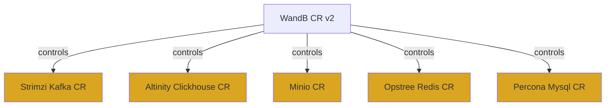

# Infra V2 Reconciliation Flows

Given that we're entering a WandB V2 Reconciliation, here is how the process flows from a coarse-grained
perspective followed by narrower and more detailed views.

The WandB V2 Custom Resource controls third-party infra CR's.

The infra CR's may have non-standard or otherwise varying behavior. As a result, some WandB reconciliation 
with those CR's may also vary and are noted here:  

* Clickhouse
* Kafka

## Top-level Flow

```mermaid
flowchart TD
    Flagged{in deletion?}

    Flagged -->|yes| Finalize
    Flagged -->|no| Write

    subgraph Finalize[Finalize]
        FKafka[Kafka]
        FCH[CH]
        FMinio[Minio]
        FRedis[Redis]
        FMysql[Mysql]
    end

    subgraph Write[Write Infra State]
        WKafka[Kafka]
        WCH[CH]
        WMinio[Minio]
        WRedis[Redis]
        WMysql[Mysql]
    end

    Finalize -.-> Write
    Write -.-> Read

    subgraph Read[Read Infra State]
        RKafka[Kafka]
        RCH[CH]
        RMinio[Minio]
        RRedis[Redis]
        RMysql[Mysql]
    end

    subgraph Infer[Infer WandB Component Status]
        IKafka[Kafka]
        ICH[CH]
        IMinio[Minio]
        IRedis[Redis]
        IMysql[Mysql]
    end

    Read -.-> Infer
    
    subgraph Summarize[Summarize WandB Status]
    end
    
    Infer -.-> Summarize

    style FKafka fill:#DAA520
    style FCH fill:#DAA520
    style FMinio fill:#DAA520
    style FRedis fill:#DAA520
    style FMysql fill:#DAA520
    style WKafka fill:#DAA520
    style WCH fill:#DAA520
    style WMinio fill:#DAA520
    style WRedis fill:#DAA520
    style WMysql fill:#DAA520
    style RKafka fill:#DAA520
    style RCH fill:#DAA520
    style RMinio fill:#DAA520
    style RRedis fill:#DAA520
    style RMysql fill:#DAA520
    style IKafka fill:#DAA520
    style ICH fill:#DAA520
    style IMinio fill:#DAA520
    style IRedis fill:#DAA520
    style IMysql fill:#DAA520
    style Finalize fill:#D3D3D3
    style Read fill:#D3D3D3
    style Write fill:#D3D3D3
    style Infer fill:#D3D3D3
    style Summarize fill:#D3D3D3
```

