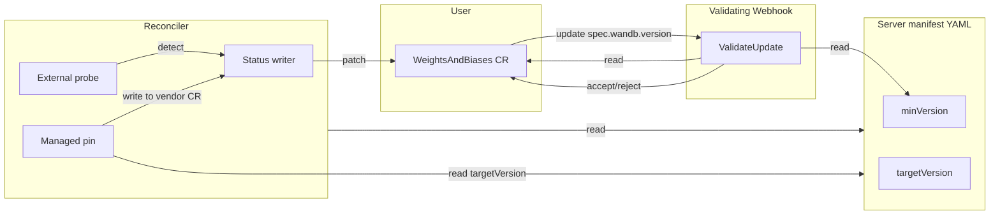

# Infrastructure Version Enforcement

**Status:** Proposed — seeking review
**Author:** Daniel Panzella
**Last updated:** 2026-04-29

## 1. Problem

The `WeightsAndBiases` CR pairs a single W&B server version with five infrastructure components: MySQL, Redis, ClickHouse, Kafka, and object store. Each W&B release is built and tested against a known set of component versions, but the operator does not currently encode any relationship between the two:

- For **managed** infrastructure (the operator deploys it via vendor operators), no image is pinned. The deployed version drifts to whatever the vendor operator's defaults happen to be at install time, which can be older than what the W&B release was tested against, or newer in ways that introduce protocol incompatibilities.
- For **external** infrastructure (the user supplies connection details), the operator only stores a connection secret and never observes what version is actually running. A user can upgrade W&B against a database that no longer supports the SQL features the new release relies on.

In both cases, the failure is not visible until the new W&B server image starts up and begins issuing traffic — and even then the symptoms (truncated columns, missing topics, ACL errors, broken aggregations) often look like configuration bugs rather than version mismatches. The problem is most acute during W&B upgrades, because that is when previously-working pairings can silently transition into broken ones.

## 2. Goals

- **Prevent unsupported W&B upgrades from being accepted by the API server.** A user attempting to bump `spec.wandb.version` to a release that does not support their currently-running external infra should receive a clear, synchronous rejection.
- **Make managed-infra versioning predictable.** The operator should deploy a known-good version per W&B release, and that version should advance automatically when the W&B release advances.
- **Source of truth lives with the W&B release.** Each server-manifest YAML is authored alongside the W&B build it describes, so it is the natural home for the compatibility statement.
- **Minimal new schema.** Reuse existing manifest sections and CRD status sub-objects; avoid new top-level types.
- **No regressions for existing deployments.** Older manifests without the new fields must continue to work; the operator falls back to today's behavior.

## 3. Non-goals

- **Auto-upgrading external infrastructure.** The operator never modifies user-supplied infra. If an external component is too old, the operator surfaces it; the user upgrades.
- **Bounding external infra at an upper version.** Newer-than-target external infra is intentionally allowed. Most users run shared databases that are upgraded on a different cadence than W&B.
- **Per-feature compatibility matrices.** Each component has a single minimum, not a feature-by-feature matrix. Refinements can be added later if needed.
- **Cross-component compatibility (e.g. "this MySQL version requires this Kafka version").** Out of scope.
- **Webhook-time probing of external infra.** Admission must be synchronous and fast; live probes do not fit. The reconciler is the actor that talks to external infra.

## 4. Design

### 4.1 Two version concepts, one source

Each per-component section in the W&B server manifest gains two optional fields:

- `minVersion` — the floor required of *external* infrastructure. Used by the validating webhook.
- `targetVersion` — the version *managed* infrastructure is deployed at. Used by the operator's vendor-spec builders.

These are separate fields because they answer different questions ("is this user's infra acceptable?" vs. "what should we deploy?"), even though in practice they are often equal. Letting them differ gives W&B release engineering room to advance the deployed target ahead of the supported floor (e.g., raise `targetVersion` for new deployments while keeping `minVersion` low so that long-lived clusters are not forced to rev immediately).

```yaml
# Example excerpt from 0.79.0.yaml
mysql:
  default:
    minVersion: "8.0.36"
    targetVersion: "8.0.36"
    sizing: { ... }
clickhouse:
  default:
    minVersion: "24.3"
    targetVersion: "24.8"
    sizing: { ... }
```

Both fields are optional. A manifest that sets neither preserves today's behavior: managed infra is deployed at the vendor-operator default, and external infra is unchecked.

### 4.2 Three actors, three responsibilities



**Reconciler — managed components.** When the manifest's `targetVersion` is set, the operator's vendor-spec builders translate it into the appropriate field on the underlying vendor CR (e.g., `InnoDBCluster.Spec.Version`, `Kafka.Spec.Kafka.Version`, image tags on the Altinity / Opstree / MinIO Tenant CRs). The deployed version is then echoed back into `status.{component}Status.version`. Managed-side version is operator-owned: there is no user override. The only existing user-facing knob, `ManagedClickHouseSpec.Version`, is removed as part of this change. v2 is still in alpha, so the field is dropped outright with no deprecation window. This avoids two competing pins.

**Reconciler — external components.** During each reconcile loop, after reading the connection secret the user supplied, the operator opens a short-lived client (using the component's native protocol), queries the running version, and writes it to `status.{component}Status.version`. Probes are best-effort — failures populate a `VersionProbeReady=False` condition with the error and leave the version field empty rather than failing the whole reconcile.

**Validating webhook.** Only `ValidateUpdate` participates. When `spec.wandb.version` actually changes, the webhook fetches the *new* manifest (using the existing `manifest.GetServerManifest`, which already caches OCI pulls to a local volume), reads each component's `minVersion`, and compares against the **status** version the reconciler last cached. The webhook is purely a status reader — it does not probe, does not call out to external systems, and runs in the time budget of an admission request.

Three outcomes per external component:

| State | Behavior |
|---|---|
| Manifest `minVersion` empty | Skip — no policy. |
| Status `version` empty | Reject — the operator hasn't observed a version yet, so we can't make a claim. The user should wait for the next reconcile cycle. |
| Status `version` < `minVersion` | Reject with both versions named. |
| Status `version` >= `minVersion` | Accept. No upper bound. |

Failure to fetch the manifest (network error, malformed YAML) is fail-closed: the webhook rejects the update. We would rather block an upgrade than silently allow one we cannot verify.

### 4.3 First-apply edge case

When a user first creates a `WeightsAndBiases` CR, `status` is empty — the webhook has no version to compare against. We deliberately do not block creates: most users would hit this on day one, and the legitimate fix (upgrade the database) is one the user can already see in the surfaced not-ready conditions. Instead, the reconciler emits a `VersionBelowMinimum` condition on the affected component, and the W&B application stays not-ready until the user fixes their infra. Subsequent updates do go through the webhook, so the strict path is enforced for the operation that actually motivates this work: upgrades.

### 4.4 Failure modes and observability

| Failure | Where | Observable |
|---|---|---|
| External infra unreachable from operator | Reconciler probe | `status.{x}Status.conditions[VersionProbeReady] = False`, error in message |
| External infra version unparseable | Reconciler probe | Same as above; `version` left empty |
| Status version below `minVersion` on update | Webhook | `apierrors.NewInvalid` with both versions named |
| Status version empty on update | Webhook | `apierrors.NewInvalid` asking the user to wait for reconciliation |
| Manifest fetch fails on update | Webhook | `apierrors.NewInvalid` — fail closed |
| `targetVersion` < `minVersion` in manifest | Manifest loader | Logged warning; operator continues. Treated as a release-engineering bug, not a user-actionable error. |

## 5. Schema additions

Two small additions; nothing renamed or removed except the deprecated managed-clickhouse version field.

**Manifest** (in `pkg/wandb/manifest/manifest.go`):

```go
type ComponentVersions struct {
    MinVersion    string `yaml:"minVersion,omitempty"`
    TargetVersion string `yaml:"targetVersion,omitempty"`
}
// Embedded in InfraConfig and KafkaConfig.
```

**Status** (in `api/v2/weightsandbiases_types.go`):

```go
type WBInfraStatus struct {
    Ready      bool               `json:"ready"`
    State      string             `json:"state,omitempty" default:"Unknown"`
    Version    string             `json:"version,omitempty"` // <- new
    Conditions []metav1.Condition `json:"conditions,omitempty"`
}
```

**Removal:** `ManagedClickHouseSpec.Version` is removed outright (v2 is still in alpha, so no deprecation window is needed).

## 6. Backward compatibility

- **Older manifests** without `minVersion` / `targetVersion` deserialize cleanly; the operator behaves exactly as today.
- **Older CRs with `spec.clickhouse.managedClickhouse.version` set** will fail validation under the new CRD schema. v2 is still alpha, so this is acceptable; affected users update their CR to drop the field.
- **The new `status.{x}Status.version` field is additive.** Older operator versions reading the same CRD will simply not see it.
- **Validating webhook is opt-in by manifest content.** Manifests authored before this change have empty `minVersion`, so the webhook accepts everything (today's behavior).

## 7. Alternatives considered

**Top-level `infraVersionRequirements:` block in the manifest.** Rejected: separates the version statement from the rest of the per-component config it relates to, and forces a parallel structure (sized component lookups by component name + instance). Inlining keeps one section per component.

**One field instead of two (just `minVersion`, with managed deploys reading from it).** Rejected: conflates "what the W&B release supports" with "what we deploy by default." Two fields let release engineering advance the deployed target ahead of the supported floor without forcing existing clusters to upgrade their infra in lockstep.

**Bounded `[minVersion, maxVersion]` window for external infra.** Considered and rejected by the design owner. Most external databases are operated independently and may legitimately run ahead of any version W&B has tested. An upper bound creates pointless rejections for the common case where newer infra is fine. If specific newer versions break, that's a `minVersion` bump for the *next* release, not a ceiling on the current one.

**Probing in the webhook.** Rejected: admission requests must be fast and cannot reliably reach customer-private databases. The reconciler is the right actor; the webhook reads the cached observation.

**Hardcoding the requirements in operator code.** Rejected: would couple every requirement bump to an operator release. The manifest is already the per-W&B-release artifact and is the natural home.

**Letting users override the managed-infra version.** Rejected by the design owner. Two pins create ambiguity, drift, and support burden. If a user needs a specific managed version, the path is to update the W&B server manifest for the release they are deploying.

## 8. Open questions

- **MinIO/S3 version reporting.** Real S3 has no version. For MinIO we can read the `Server` header; for AWS/GCS we should record a marker (e.g. `"s3"` or `"gcs"`) and skip the `minVersion` check. The exact marker scheme should be agreed before implementation.
- **Kafka version detection.** `ApiVersions` returns supported API ranges, not a clean broker version string. We will likely have to derive a representative version from the highest supported APIs, or use vendor-specific endpoints. Open as to which library to use.
- **Probe credentials.** The probe uses the same connection secret the W&B applications use. Some users may want to provide a read-only credential specifically for version probing — out of scope for v1, but a possible extension.

## 9. Implementation status

A detailed implementation plan with exact file paths and dependencies lives in [plan-infra-version-enforcement.md](../../plan-infra-version-enforcement.md).
