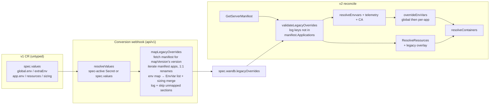

# Legacy Overrides: carrying v1 helm values into v2

## Problem

The v1 `WeightsAndBiases` spec is untyped: `spec.values` is an arbitrary map passed to
the `operator-wandb` helm chart. Many v1 configurations have no strongly-typed home in
the v2 spec — most importantly:

- **global env vars** (`global.env`, `global.extraEnv`) applied to every application,
- **per-application env vars** (`<app>.env`, `<app>.extraEnv`),
- **per-application resource overrides** (`<app>.resources`, `<app>.sizing.<size>.resources`).

Until these get first-class v2 fields, we carry them through conversion in
`spec.wandb.legacyOverrides` (added in commit `8a344a7`) and apply them during
reconcile so a converted install keeps its effective v1 configuration.

```go
// api/v2/weightsandbiases_types.go
LegacyOverrides map[string]LegacyOverrides `json:"legacyOverrides,omitempty"` // on WandbAppSpec

type LegacyOverrides struct {
    Env       []corev1.EnvVar              `json:"env,omitempty"`
    Resources *corev1.ResourceRequirements `json:"resources,omitempty"`
}
```

Map keys are **v2 manifest application names**, plus the reserved key **`global`**
(env only) which applies to every application. The server manifest is the
authority on which keys are valid: sections that don't correspond to a manifest
application are logged at reconcile time and never applied — but for now they are
left in place in the spec (see *Manifest validation*).

## How v1 (the helm chart) actually behaves

Facts established from `wandb-base/templates/_containers.tpl` and verified with
`helm template` renders; the conversion and reconcile semantics below are derived
from them.

- Every app key in `operator-wandb/values.yaml` is an aliased instance of the
  `wandb-base` library chart, so all apps support the same env/resources keys.
- Env layers are **maps** keyed by env var name; values are either scalars
  (string-coerced) or full `EnvVar` bodies (`valueFrom:` supported). Precedence
  (highest → lowest), collapsing to one entry per name:
  1. `<app>.containers.<n>.env`
  2. `<app>.env`
  3. `<app>.extraEnv`
  4. `global.env`
  5. `global.extraEnv`
  6. `sizing.<size>.env`
  7. chart-computed `envTpls` (an entry is *removed* when any layer above defines the same name)
  8. `envFrom` config maps/secrets
- **User env at any layer beats chart-computed env.** This is the load-bearing
  behavior the v2 reconcile must reproduce: overrides must win against
  manifest-provided env.
- Resources merge deep, per-field: `containers.<n>.resources` > `<app>.resources`
  (legacy flat key) > `sizing.<effective size>.resources`, where effective size is
  `coalesce(<app>.size, global.size, "small")` and the size entry is overlaid onto
  `sizing.default`.
- All env layers reach main containers, init containers, and Job/CronJob pods.
  `Values.resources`/sizing resources reach main containers only.

## Design

The server manifest is the single authority on which applications exist —
there is no hardcoded list of helm app keys anywhere. Conversion resolves the
manifest itself: `mapVersion` runs first and derives `spec.wandb.version` from
`app.image.tag`/`api.image.tag`, and the manifest for that version is an
immutable artifact fetched through the same `manifest.GetServerManifest`
resolver the reconciler uses (OCI via ORAS with its on-disk store, or
`file://`). This keeps conversion stateless in the way that matters: it remains
a pure function of (values, version) — the manifest is just versioned static
data, cached in-process (5 min success / 1 min failure TTL, 15 s fetch
timeout).

Reconcile-time validation still exists as a second line — it guards
hand-edited v2 CRs and version drift — mirroring the existing split for
external-infra literals (`mapMySQL` → pending annotation →
`migrateLegacyAnnotations`).

### Phase 1: Conversion (v1 → v2)

A new mapper `mapLegacyOverrides(values, dst)` runs in `applyValueMappings`
(`api/v1/weightsandbiases_conversion_mapping.go`) alongside the other
peer-of-global mappers (it reads top-level app keys, like `mapVersion` does).
It is pure extraction — stateless, no client — over the `resolveValues()` output,
so the spec-active Secret's coalesced values are preferred, same as every other
mapper.

**Manifest-driven extraction.** Conversion resolves the server manifest for the
converted version and iterates `manifest.Applications`: for each application
name, it reads the matching top-level values section — the helm alias for the
two **unambiguous 1:1 renames** (`nginx-proxy` ← `nginx`,
`weave-trace-evaluate-model-worker` ← `weave-evaluate-model-worker`; helm
knowledge, so the tiny rename map lives here), the name itself otherwise — and
extracts its env/extraEnv/resources. Only manifest applications are ever
copied, so the spec never carries junk keys, and a new application in a future
manifest needs no conversion change.

Sections that carry the override shape we extract (`env`/`extraEnv`/`sizing`)
but match no manifest application — the v1 monolith `app`, `console`,
`history-updater`, `mcp-server`, … — are **logged and skipped** at conversion.
(The flat `resources` key is deliberately not part of that detection signature:
infra subchart sections like `mysql` legitimately carry it and would be false
positives.) There is **no `app` → `api` translation**: the monolith's overrides
were tuned for a different binary, and grafting them onto v2's `api` risks more
than it fixes. Skipped sections stay recoverable in the
`legacy.operator.wandb.com/v1-values` annotation.

**Failure containment.** Manifest resolution is best-effort and never fails
conversion: a fetch error (offline cluster, version with no published manifest)
would otherwise make v1 objects unservable and v1 writes impossible. On error —
or when values yield no version at all — only the per-application extraction is
skipped, with a log; global env still converts, and a later re-apply (once the
manifest is reachable) re-extracts everything.

**Env extraction.**

- `legacyOverrides["global"].Env` = `merge(global.env over global.extraEnv)`.
- `legacyOverrides[<key>].Env` = `merge(<key>.env over <key>.extraEnv)`.
- Map-shaped values decode into `corev1.EnvVar` via JSON round-trip (name from the
  map key); malformed bodies fail conversion with a `spec.values.<path>` error,
  matching existing mapper behavior. Scalars go through the existing
  `scalarToString` (bools/numbers become strings, as helm's `toString` did).
- Entries whose string value contains `{{` are **dropped with a log line, never a
  conversion failure**: they are helm template expressions we cannot evaluate,
  and failing conversion would block serving the object over one env var.
  Kubernetes `$(VAR)` interpolation passes through untouched.
- Env slices are **sorted by name** so conversion is deterministic and the
  v2 → v1 → v2 round-trip is idempotent (required by `TestConvertRoundTrip`).

**Resources extraction.** Per candidate key, deep-merge exactly what the user set —
`sizing.default.resources`, then `sizing.<effective size>.resources`, then
`<key>.resources` — into one `ResourceRequirements`. We extract only fragments
present in the resolved values (user values + release-channel defaults; chart
defaults never appear there), so an install that never touched resources converts
with no resource overrides and v2 manifest sizing applies untouched. No resources
are extracted for `global` (the chart has no global resources).

`ConvertFrom` needs **no reverse mapping** — it already restores v1 purely from
the v1-values annotation.

### Phase 2: Manifest validation at reconcile (log-only, no pruning for now)

`validateLegacyOverrides(ctx, wandb, manifest)` runs in the v2 reconcile
immediately after the server manifest is resolved and before
`reconcileApplications`. With conversion already filtering against the
manifest, this is a second line of defense for hand-edited v2 CRs and for
version drift (the spec's overrides were extracted against one manifest
version; the reconciler may be running another):

- Valid keys are the reserved `"global"` plus any name in
  `manifest.Applications`. Validity is judged against the full application map,
  **not** the feature-filtered set — an override for a feature-gated app is
  valid and takes effect if the feature is enabled.
- Every other key is logged at Warn once per reconcile pass: `legacy override
  section %q does not map to any application in server manifest %s; ignoring`.
- **The spec is not modified.** Unmapped keys stay in
  `spec.wandb.legacyOverrides`; they are simply never applied, because the apply
  path only ever looks up `"global"` and manifest application names. Pruning the
  spec was considered and deferred — we can revisit once migration behavior has
  been observed in the field.

### Phase 3: Applying overrides during reconcile

All changes are on the `WeightsAndBiases` side (`internal/controller/reconciler/`);
the `Application` controller copies pod templates verbatim and needs no changes.
`reconcileApplications`, `resolveContainers`, and `ResolveResources` already
receive the full `*v2.WeightsAndBiases`, so no plumbing is required. The apply
path looks up only `"global"` and the current app's manifest name, so unmapped
keys left in the spec are inert here by construction.

**Env.** In `reconcileApplications` (`reconcile_v2.go`), after all existing env
construction (manifest env, telemetry injection, custom-CA injection) and
immediately before `resolveContainers`:

```go
envVars = overrideEnvVars(envVars, wandb.Spec.Wandb.LegacyOverrides["global"].Env)
envVars = overrideEnvVars(envVars, wandb.Spec.Wandb.LegacyOverrides[app.Name].Env)
```

`overrideEnvVars(base, overrides)` is a new helper: replace-by-name in place,
append when missing — the inverse of `appendMissingEnvVars` (existing wins), which
cannot be reused. Ordering: global first, per-app second, so per-app beats global —
matching the chart's layer precedence. Applying last means overrides beat
manifest/common env, telemetry defaults, and CA env — exactly as user env beat
chart-computed `envTpls` in v1. Because the env slice is shared, init containers
receive the same overrides, which also matches v1.

**Resources.** In `ResolveResources` (`sizing.go`), overlay the per-app override as
the final merge step, after the container-level merge:

```go
if lo, ok := wandb.Spec.Wandb.LegacyOverrides[app.Name]; ok && lo.Resources != nil {
    resources = mergeResources(resources, lo.Resources, wandb.Spec.RequireLimits)
}
```

The overlay respects `spec.requireLimits`, like every other merge in
`ResolveResources`: when `requireLimits=false` (the default), only the requests
from a legacy override are applied and its limits are stripped. This keeps the
v2 no-limits-by-default policy uniform across sizing- and legacy-derived
resources; converted requests are preserved either way, and setting
`requireLimits: true` re-enables the converted limits. (Deliberate divergence
from v1, where configured limits were always enforced — to be reevaluated.)
`ResolveResources` runs per main container only — init containers get no
`Values.resources`/sizing merge, same as v1. The `global` entry's `Resources` is
ignored (documented; there is no v1 analog).

**Migrations.** The `global` env entry is also applied (same helper) to migration
task env in `runMigrations`, since v1's global env reached job pods too — the
canonical use case is `HTTP_PROXY`/`NO_PROXY`, which migrations need as much as
the apps do. Per-app entries do not apply to migrations (no v1 analog).

**Hand-authored content.** Editing `legacyOverrides` directly in a v2 CR is
discouraged but not prevented — and we assume it will happen. So there is no
blocking webhook validation beyond the CRD schema, the field's doc comment (and
`docs/config-api.md`) steer users toward first-class fields, and the apply path
is defensive: entries with an empty name are skipped with a log,
`overrideEnvVars` resolves duplicate names within an override deterministically
(last entry wins), and unknown map keys are already logged and ignored by
manifest validation. Invalid env var names or resource quantities the CRD schema
can't catch surface as Deployment create/update errors on the owned
`Application`, same as any other bad pod-template input.

### Precedence summary (v2, after this change)

Highest → lowest for an application's container env:

1. `legacyOverrides[<app>].env`
2. `legacyOverrides["global"].env`
3. custom-CA / telemetry injected env (append-if-missing passes)
4. manifest `app.Env`
5. manifest `CommonEnvs` groups

Resources, per main container: `legacyOverrides[<app>].resources` >
manifest container resources > manifest `sizing[spec.size]` > manifest
`sizing.default`.

### Flow



## Out of scope (dropped, preserved only in the v1-values annotation)

- `<app>.containers.<n>.env|resources` (per-container overrides)
- `envFrom` (configMapRef/secretRef maps), `envTpls`, `global.extraEnvFrom`
- helm-template-valued env entries (`{{ ... }}`)
- `sizing.<size>.env` (t-shirt env vars; the v2 manifest owns these)
- infra subchart keys (`mysql`, `redis`, `kafka`, `clickhouse`, …) — already
  mapped to typed fields by the other conversion mappers, or genuinely not apps

Sections for apps with no v2 counterpart (`app`, `console`, `history-updater`,
`mcp-server`, job/hook keys, …) are logged and skipped at conversion — they
never enter the spec.

## Implementation plan

### Step 0 — API cleanup (before anything references the field)

1. `api/v2/weightsandbiases_types.go`: rename Go field `LegacyOveriddes` →
   `LegacyOverrides` (JSON tag already correct, so this is API-compatible);
   change `Resources` to `*corev1.ResourceRequirements` (`omitempty` is a no-op on
   struct values, and presence must be distinguishable); add doc comments —
   including an explicit note that the field is populated by v1→v2 conversion
   and hand-editing is discouraged in favor of first-class fields. (This repo
   generates CRDs with `maxDescLen=0`, so the comments serve godoc/readers of
   the types, not the CRD schema.)
2. `make manifests generate sync-crd-embed`.

### Step 1 — Conversion

3. New `api/v1/weightsandbiases_conversion_overrides.go`:
   - `mapLegacyOverrides(values map[string]interface{}, dst *appsv2.WeightsAndBiases) error`,
     registered in `applyValueMappings` after `mapIngress` (so `mapVersion` has
     already derived the version).
   - `legacyManifestApps`: resolves the manifest via
     `manifest.GetServerManifest` (repository = the shared
     `appsv2.DefaultManifestRepository` constant, also used by the defaulting
     webhook) behind a TTL cache and a `SetConversionManifestGetter` test seam;
     failures skip per-app extraction with a log.
   - The two-entry rename map plus helpers following existing idioms
     (`unstructured.Nested*`, errors prefixed `spec.values.<path>`): env over
     extraEnv merge, scalar coercion, strict EnvVar-body decode, `{{` skip,
     name-sorted output; resources = sizing default → effective size → flat
     `resources` merge, using `coalesce(<app>.size, global.size, "small")`;
     unmapped-section logging keyed on the `env`/`extraEnv`/`sizing` shape.
4. Tests in `api/v1/weightsandbiases_conversion_overrides_test.go` (plain Go +
   `require`, `newV1(values)` fixtures, fake manifest getter installed by a
   package `TestMain` so unit tests never fetch over the network,
   `withConversionReader` for spec-active Secret cases): global/per-app
   extraction and env/extraEnv precedence, scalar coercion, `valueFrom` bodies,
   template-string drop, renames, unmapped sections skipped, resources/size
   selection, manifest-unavailable and no-version fallbacks, per-version fetch
   caching, round-trip idempotency, spec-active Secret preference.

### Step 2 — Manifest validation

5. `validateLegacyOverrides` in `internal/controller/reconciler/` (new file
   `legacy_overrides.go`), called from the v2 reconcile after
   `GetServerManifest`, before `reconcileApplications`; Warn log per unmapped
   key; **no spec mutation, no CR update**.
6. Tests (in-memory manifest, no client needed): valid keys accepted, `global`
   always accepted, unmapped keys reported, feature-gated apps accepted,
   spec unchanged afterward.

### Step 3 — Applying overrides

7. `overrideEnvVars` helper + unit tests (including hand-authored edge cases:
   duplicate names within an override → last wins; empty-name entries skipped
   with a log).
8. Apply global + per-app env in `reconcileApplications` before
   `resolveContainers`; apply global env in `runMigrations`.
9. Legacy overlay in `ResolveResources` (+ `RequireLimits` behavior tests in
   `reconcile_v2_sizing_test.go` style).
10. Tests: plain unit tests in package `reconciler` (fake client only where
    `resolveEnvvars` is exercised), covering the precedence table above.

### Step 4 — Verification & docs

11. `make lint && make test`.
12. Add a v1 fixture with env/resources overrides (including one deliberately
    unmapped section, e.g. `console`) under `hack/testing-manifests/wandb/` and
    verify end-to-end via Tilt/Kind: create the v1 CR, confirm `legacyOverrides`
    on the stored v2 object, confirm the unmapped section is logged and remains
    in the spec without affecting any Deployment, confirm env and resources land
    on the rendered Deployments, confirm
    round-trip (`kubectl get wandb.v1... -o yaml` still shows original values).
13. User-facing documentation lives in the API type's doc comments and this
    design doc. (`docs/config-api.md` turned out to be v1 console-API docs — the
    wrong venue; revisit if a v2 CR reference doc is added.)

## Resolved design decisions

| Decision | Choice | Rationale |
|---|---|---|
| Authority on valid app names | the server manifest, resolved *during conversion* (and re-checked at reconcile) | no hardcoded app list to rot; the manifest is immutable versioned data, so fetching it keeps conversion a pure function of (values, version) |
| Manifest fetch failure / no version | skip per-app extraction with a log, never fail conversion; global env still converts | erroring would make v1 objects unservable for offline clusters or versions with no published manifest |
| Unmapped sections | logged and skipped at conversion; reconcile re-checks spec keys (hand-edits, version drift) and leaves them in place | visibility without destructive spec edits; only manifest apps ever enter the spec |
| helm `app` (monolith) overrides | not translated to `api`; unmapped, so logged and skipped | monolith env/resources were tuned for a different binary; grafting them onto v2 `api` causes more problems than it solves |
| Renames (`nginx`, `weave-evaluate-model-worker`) | applied at conversion | unambiguous 1:1, and helm-key knowledge belongs in conversion |
| Global env representation | reserved `"global"` map key, merged at reconcile | keeps CR small; apps added by newer manifests still inherit it |
| Override vs manifest env | overrides win (replace-by-name) | mirrors v1, where user env at any layer displaced chart-computed env |
| Legacy limits vs `requireLimits=false` | respect `requireLimits`: limits stripped unless it's true | keeps the v2 no-limits-by-default policy uniform; reevaluate later if migrated installs need their v1 limits back |
| Resources: replace or merge | deep-merge overlay per field | mirrors helm's deep merge (verified: overriding `requests.cpu` kept chart limits) |
| Malformed env bodies | fail conversion | consistent with `classifyValueFromOrLiteral` and other mappers |
| Helm-templated env values (`{{ ... }}`) | log and drop, never fail conversion | can't be evaluated outside helm; failing would block serving the object over one env var |
| Hand-editing `legacyOverrides` | discouraged, not prevented; assumed to happen | no blocking webhook validation; doc comments + docs steer to first-class fields; apply path is defensive (empty names skipped, duplicates last-wins, unknown keys logged + ignored) |
| Reverse (v2→v1) mapping | none | `ConvertFrom` restores from the v1-values annotation already |

## Open questions

None — all design decisions are resolved above.
