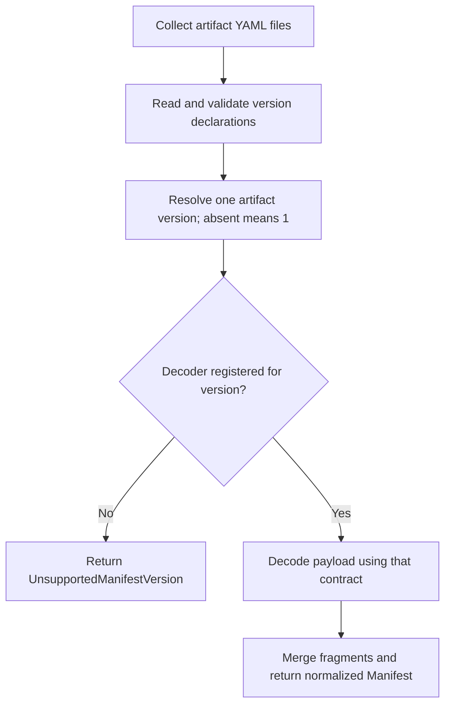

# Server manifest contract versioning

**Status:** Proposed engineering design. Runtime behavior is not implemented by
this document. The initial implementation supports manifest contract version 1
only and treats an omitted version as version 1.

**Decision.** Version the contract between the server manifest producer and the
operator independently of W&B and operator release numbers. Each manifest
artifact declares one positive integer `manifestVersion`. The operator embeds
the exact set of contract versions it implements. Deployment is permitted only
when the artifact's effective version belongs to that set.

For the first implementation:

```text
legacy default:              1
supported manifest versions: [1]
```

An omitted version is a permanent alias for version 1, not for the newest
supported version. Supporting a newer contract requires an explicit code change;
installing a newer operator does not automatically imply support for higher
numbers. Product release tags, including beta, RC, nightly, and branch tags, do
not participate in this compatibility check.

**Scope.** Add version detection, validation, operator enforcement, observable
failure behavior, and explicit version-1 output from the server manifest
generator. Preserve the behavior of existing unversioned artifacts and their
payload decoding. This change does not introduce contract version 2, a server
release floor, a new CR spec field, a Helm compatibility override, or a way to
bypass an unsupported contract. Database upgrade and downgrade safety, product
support windows, and defects in an implementation of a supported contract remain
separate concerns.

**Current implementation.** These entry points determine where the work belongs:

| Area | Current behavior | Design consequence |
| --- | --- | --- |
| [Manifest loading](../../../pkg/wandb/manifest/manifest.go) | `file://` and OCI artifacts decode each YAML file into `Manifest`, then call `mergeSimple`. | Both paths need the same artifact-level version resolution before typed payload decoding. |
| [W&B reconciliation](../../../internal/controller/reconciler/reconcile_v2.go) | Manifest loading precedes infra sizing and provisioning, but follows legacy CR migrations that can write Secrets. | Move manifest loading and the compatibility gate ahead of those legacy migrations. Keep deletion handling first. |
| [Readiness](../../../internal/controller/reconciler/readiness.go) | Existing helpers update `Ready`, `status.ready`, and its metric. | Reuse them for a blocked desired configuration. |
| [v1 conversion](../../../api/v1/weightsandbiases_conversion_overrides.go) | Application override conversion requires the manifest and propagates loading errors. | Unsupported contracts must not be decoded as v1 or cause overrides to be silently discarded. |
| [Core manifest template](https://github.com/wandb/core/blob/99fcc725c7b9d36a391067f4633c2173afe4d4c0/onprem/server-manifest/templates/manifest.yaml.tpl) | Emits `requiredOperatorVersion: ^2.0.0`, without a manifest contract version. | Add the literal `manifestVersion: 1`. |
| [WSM manifest mirroring](https://github.com/wandb/wsm/blob/0b4e745108b5512277abc1d652d9e619327d4afa/cmd/wsm/registry_manifest.go) | Rewrites a YAML node tree, but enumerates images using typed manifest structs. | Verify version metadata survives mirroring; future contract support must also cover image enumeration. |

The existing `RequiredOperatorVersion` field is decoded but not enforced by the
operator. Keep accepting it as deprecated, inert metadata. It neither overrides
nor supplements `manifestVersion`. Retain it in the initial producer change to
avoid an unrelated removal; removing it later requires a consumer audit. Do not
start enforcing its existing SemVer expression as part of this change.

**Wire contract.** New artifacts explicitly declare version 1 in their root
manifest:

```yaml
---
manifestVersion: 1
requiredOperatorVersion: ^2.0.0 # Deprecated; retained during initial rollout.

applications:
  # Existing version-1 payload.
migrations:
  # Existing version-1 payload.
```

The version applies to the complete artifact, including `sizing.yaml` and other
fragments. It is unrelated to the Kubernetes CR API version `apps.wandb.com/v2`.
The artifact's registry tag continues to identify the requested W&B release.

Metadata validation distinguishes absence from a present invalid value:

| Input | Effective result in the initial operator |
| --- | --- |
| No declaration anywhere in the artifact | Version 1; load normally. |
| `manifestVersion: 1` | Version 1; load normally. |
| `manifestVersion: 2` or another positive unsupported integer | Unsupported contract; do not decode its payload as version 1. |
| `0`, a negative value, or an integer outside the chosen Go representation | Invalid version metadata. |
| `null`, an empty value, `"1"`, `""`, a boolean, a fractional number, a sequence, or a mapping | Invalid version metadata; no coercion to version 1. |
| Duplicate `manifestVersion` keys in one document | Invalid version metadata, even if the values agree. |
| Conflicting explicit versions across files | Invalid version metadata. |

Use a positive decimal integer scalar for explicit declarations. Extract the
field with a presence-aware YAML parser rather than relying on an integer's zero
value or a pointer that treats both missing and null values alike. Validate the
field's type before any YAML-to-JSON conversion that could coerce its value.

For artifacts containing multiple files, collect all explicit declarations
before applying the default. If none exist, choose 1. Otherwise every explicit
declaration must be valid and identical; fragments without a declaration inherit
that version. Repeated equal declarations across files are accepted, although
the producer writes the field only in `manifest.yaml`. A version-2 root plus an
unversioned sizing fragment is version 2, not a conflict with an implicit 1.
File names and iteration order do not choose the version. This also preserves
the existing single-file `<release>.yaml` local format.

Version resolution must operate on the same YAML documents that payload loading
consumes. It must not discover a version in a document and silently decode a
different document. Defining a new multi-document payload format is outside this
change. Malformed YAML remains an error rather than an unversioned artifact.

**Loader architecture.** Factor the file and OCI paths into a common decoder
after they have collected the artifact's YAML bytes. Preserve source file names
for diagnostics. The loader follows this sequence:



Keep a private decoder registry in `pkg/wandb/manifest`, initially containing
only version 1. Derive the sorted supported-version list from that registry so a
separate advertised list cannot drift from the implementation. An exported
`SupportedVersions()` helper returns a copy for callers and error messages.
Registering a version asserts support for its decoding and reconciliation
semantics; a decoder alone is not sufficient to claim a future version.
There is no environment variable, Helm value, or mutable exported registry that
can claim support for an unimplemented version.

Add `ManifestVersion` to the decoded `Manifest`, with explicit YAML and JSON
field names for the decoder in use. Set it once to the resolved positive version
after decoding. Do not send fragment metadata through `mergeSimple`'s existing
first-nonempty-field behavior. Defaulting occurs only at the artifact boundary;
an explicitly supplied zero never becomes a supported version. Programmatic
manifest constructors and tests should supply version 1 when they bypass the
wire loader. Retain whether the declaration was explicit as loader provenance
for diagnostics, separate from serialized manifest payload fields.

The version-1 decoder retains today's payload decoding and merge behavior.
Strict validation of the new metadata does not imply switching the entire
legacy payload to strict unknown-field rejection. Broader schema validation
would require its own compatibility assessment. A version-2 payload is never
passed to the version-1 decoder as a fallback.

Validate cached OCI artifacts on every load, using the current binary's decoder
registry. The existing cache may retain raw unsupported artifacts; a cached
artifact is not evidence of compatibility. Preserve repository-scoped caching
and authentication. Tags are treated as immutable under the existing cache
behavior; correcting metadata means publishing a new artifact reference, not
relying on a periodic reconcile to refresh a retagged cached artifact.

Use typed errors that survive wrapping with `%w`: `InvalidManifestVersionError`
for invalid or conflicting declarations, and `UnsupportedManifestVersionError`
for a valid version without a decoder. Include the relevant file and version,
plus the sorted supported set for unsupported-version errors. Transport and
version-1 payload decoding errors remain distinguishable from these errors.

**Reconciliation.** Handle deletion and retention finalizers before fetching a
manifest. On a live resource, adding the existing finalizer is permitted before
the gate. Then resolve registry credentials and load the manifest. Perform this
before `migrateLegacyAnnotations`, `mapLegacyEnvToCR`, infra sizing, or any other
reconciliation that can write workload, credential, networking, or infra state.
The legacy helpers currently precede loading; merely adding a check after the
current load site would leave earlier writes outside the gate.

On unsupported or invalid metadata, update the CR's status, emit a transition
event, and stop this W&B reconciliation. Do not create, modify, or delete its
Applications, migration Jobs, Secrets, networking, or managed infrastructure.
Keep the manager healthy and continue reconciling other W&B instances. Existing
child controllers can still reconcile their already accepted Application specs,
and already running Jobs can finish; this gate does not suspend those controllers
or undo a rollout that started before the unsupported target was selected.

Successful loading admits the artifact for this reconciliation. Persist the
successful compatibility condition before later operations can return early.
Compatibility does not itself set `Ready=True`; normal dependency, migration,
and application-readiness checks still apply. Any independently callable helper
that accepts a constructed `Manifest` and writes resources must enforce the same
version check or be made internal to the validated path. In particular, account
for direct calls to `ReconcileWandbManifest` and
`ReconcileNetworkingAndWatchtower` in tests.

**Status and recovery.** Use the existing `status.conditions` array, without
adding CRD fields, to publish a `ManifestCompatible` condition:

| Result | `ManifestCompatible` | Reason |
| --- | --- | --- |
| Version-1 artifact loads successfully, explicit or implicit | `True` | `SupportedManifestVersion` |
| Valid but unsupported contract | `False` | `UnsupportedManifestVersion` |
| Invalid or conflicting version metadata | `False` | `InvalidManifestVersion` |
| Credentials or artifact retrieval fail | `Unknown` | `ManifestUnavailable` |
| YAML or payload decoding fails | `Unknown` | `InvalidManifest` |

For any result other than `True`, also set `Ready=False` and `status.ready=false`
through the existing readiness helper. This describes the requested
configuration; it does not assert that previously running workloads are down.
Use `apimeta.SetStatusCondition` so conditions carry the current
`observedGeneration` and retain transition time when unchanged. Do not advance
the top-level `status.observedGeneration` that currently represents application
reconciliation merely because compatibility was checked.

A representative error message for a hypothetical version-2 artifact is:

```text
Server manifest <repository>:<server-tag> declares manifestVersion 2;
this operator supports [1]. Install an operator supporting version 2
or select a server manifest using version 1.
```

For version 1, the success message states whether it was explicit or defaulted
from an omitted declaration. Events are emitted on outcome transitions rather
than on every retry. Metadata failures return the existing bounded reconcile
interval of one minute with no controller error after status is saved; status
write failures and transient retrieval errors use normal error retry behavior.
CR edits and operator restarts also trigger reevaluation. Recovery clears the
previous compatibility failure; ordinary readiness then describes any remaining
work. Reverting a manifest selection is not a guarantee that a database downgrade
is safe.

**Conversion behavior.** Rejecting an unknown contract before typed decoding is
a loader invariant, including for the conversion webhook. Current v1-to-v2
conversion requires application metadata to preserve per-application overrides;
it must continue to return an error when that metadata cannot be loaded.
Keep the typed compatibility explanation in the wrapped conversion error and
preserve the existing failure cooldown. Do not turn this into successful
conversion with missing overrides, and do not guess that a future payload has
version-1 application semantics.

Unversioned and explicit-version-1 conversions continue to work. A v1 request
selecting an unsupported artifact can fail before a CR exists, so it may have an
API error rather than a status condition. The CRD stores v2 objects, and current
admission webhooks target v2; existing v2 objects must remain readable, editable
through the v2 API, and deletable when their manifest is unsupported. Test those
recovery paths. For a historically stored v1 object whose conversion requires an
unsupported manifest, recovery can require an operator that understands that
contract. The version-1 default introduces no such failure for existing
unversioned artifacts; future removal of version-1 support must explicitly
address stored-version migration and conversion.

**Producer and tooling rollout.** Ship the following work in order:

1. Implement the operator loader, status handling, and reconciliation gate with
   only version 1 registered. Keep historical fixtures unversioned and add
   explicit-version-1 fixtures alongside them. Existing installations need no
   manifest republishing or CR changes.
2. Add the literal `manifestVersion: 1` to the core server-manifest template and
   validate the rendered artifact in producer CI. Do not derive it from the
   server release tag or expose it as an ordinary release-build override. Keep
   the existing compatibility field inert during this initial rollout.
3. Add WSM regression coverage proving that mirroring preserves explicit version
   metadata and leaves unversioned metadata absent. Its existing server-release
   floor and release discovery policy are unchanged by this implementation.

Old operators ignore the new version-1 field and continue decoding the same
payload. They also lack the new enforcement mechanism: publishing a future
version-2 manifest cannot make them reject it. Before introducing a newer
contract, establish an upgrade path from those older operators and require an
enforcing operator through deployment tooling or a release-specific rollout
procedure. This initial change does not claim to protect arbitrary future
contracts from old binaries.

WSM preflight against a target operator's supported versions is a follow-up,
not a dependency of the initial operator gate. WSM currently uses typed
structures to enumerate images, so preserving an unknown version field does not
make WSM capable of mirroring an unknown contract. Before publishing version 2,
its consumers must either implement that contract or reject it before partial
image enumeration. Preflight should eventually inspect metadata associated with
the selected operator artifact, not infer support from WSM's pinned operator Go
dependency.

**Contract evolution.** Version 1 names the current manifest structure and
operator semantics. Routine image, configuration-value, or sizing changes that
use those semantics stay on version 1. New required fields, enum cases, changed
defaults, or different required resource/migration behavior need a new revision
when ignoring or misinterpreting them would produce an incorrect deployment.
Published revisions are immutable, including when first used by a beta or
nightly product build. Reserve revisions through the shared contract design;
parallel branches must not assign different meanings to the same revision.

A future operator may register `[1, 2]` to provide an overlapping upgrade path,
then later drop 1 after a separate migration design. A producer declares the
oldest contract sufficient for its requirements. Higher integers do not mean
that all lower versions remain supported. Historical unversioned artifacts
always resolve to 1, including after support for 1 is eventually removed.

**Implementation outline.** Keep this initial change limited to these areas:

| Repository and files | Work |
| --- | --- |
| Operator `pkg/wandb/manifest/manifest.go` plus a focused version helper | Presence-aware metadata extraction, common artifact decoder, version-1 registry, normalized result, typed errors. |
| Operator `internal/controller/reconciler/reconcile_v2.go`, `readiness.go`, and focused tests | Move the gate before legacy writes, set compatibility/readiness conditions, stop writes on failure, preserve finalization and recovery. |
| Operator `api/v1/weightsandbiases_conversion_overrides.go` and conversion tests | Preserve error causes and override integrity; verify legacy success and unsupported-contract errors. |
| Operator manifest fixtures and tests | Cover omitted and explicit version 1 plus invalid/unsupported metadata. |
| Core `onprem/server-manifest/templates/manifest.yaml.tpl`, generator documentation, and producer checks | Emit and validate version 1. |
| WSM `cmd/wsm/registry_manifest_test.go` | Verify metadata preservation during image rewriting. |

No operator binary release-version injection, new Helm settings, or generated
CRD changes are required for this design. After implementation, put the durable
wire and loader contract in `pkg/wandb/manifest/README.md` and link the producer
documentation to it; retire the proposed design once its decisions are recorded.

**Validation and acceptance.** The implementation should establish these
behaviors with focused tests:

- Legacy and explicit-version-1 artifacts produce equivalent decoded payloads
  and generated resources. An explicit version field is the only metadata
  difference; no new migration or rollout occurs solely because of its presence.
- Local single-file, local multi-file, and in-memory OCI fixtures use identical
  version rules. File ordering and cached versus freshly loaded content cannot
  bypass validation. A higher version with an incompatible payload returns an
  unsupported-version error before typed payload decoding.
- Cover all metadata cases in the input table, matching/conflicting declarations
  across files, and missing fragment declarations that inherit an explicit
  artifact version. The supported-version list is exactly `[1]` initially.
- A recording client or equivalent reconciliation fixture proves that invalid
  or unsupported artifacts cause no managed-resource writes, including legacy
  Secret migration, beyond the allowed finalizer/status updates and Events.
  Existing resources remain in place, and another compatible CR reconciles.
- Compatibility failure is visible even when the CR was previously ready.
  Repeated failure does not churn transition time or Events. Recovery, transient
  fetch failure, deletion with an unsupported version, and direct helper calls
  behave as specified.
- v1 conversion preserves all existing overrides for implicit and explicit
  version 1. Unsupported or invalid metadata returns a useful error without a
  successful partial conversion. Existing v2 objects retain the recovery paths
  described above.
- Generated core manifests contain the integer `1` in the root file. WSM image
  rewriting preserves it and does not insert a field into legacy fixtures.

For operator implementation changes, run focused manifest, conversion, and
reconciler tests, then the repository's `make lint` and `make test` checks with
their required local dependencies. Use an in-memory OCI fixture for loader
coverage and envtest where API conversion or status behavior needs an API server;
these checks should not depend on a live registry. A release smoke test should
exercise an existing unversioned server artifact and an otherwise equivalent
explicit-version-1 artifact. Producer and WSM checks run in their respective
repositories. This document-only change does not run those implementation tests.
