# Multi-Instance Infrastructure (MySQL, Redis, ObjectStore, ClickHouse)

## Status

Implemented (alpha). Kafka is intentionally **out of scope** and remains
single-instance.

## Context

The W&B v2 API originally modeled exactly **one** instance of each backing
infrastructure type. `Spec.MySQL`, `Spec.Redis`, `Spec.ObjectStore`, and
`Spec.ClickHouse` were each a single struct, and each had a single matching
status field carrying one connection.

We want a single W&B deployment to provision and connect to **multiple**
instances of each of these four types — for example a primary MySQL plus a
separate analytics MySQL — and to route individual applications to the correct
instance. This document describes the design that delivers that capability and
the conventions future revisions should preserve.

## Goals

- Allow N instances per infra type (MySQL, Redis, ObjectStore, ClickHouse).
- Let the **server manifest** decide which application connects to which
  instance.
- Guarantee a safe fallback: an app that requests an unprovisioned instance
  resolves to a well-known **default** instance instead of failing.
- Keep the change surface to the operator; no new external coordination.

## Non-goals

- Kafka multi-instance (deliberately deferred).
- Backwards-compatible data migration of existing v2 CRs. The project is in
  alpha, so the v2 schema change is allowed to be breaking. (The v1→v2
  conversion webhook still compiles and maps the single v1 infra into the
  `default` instance.)

## Design overview

### The map model

Each of the four infra types becomes a **map keyed by instance name**. A
reserved key, `apiv2.DefaultInstanceName` (`"default"`), identifies the fallback
instance.

```go
// api/v2/weightsandbiases_types.go
type WeightsAndBiasesSpec struct {
    MySQL       map[string]MySQLSpec       `json:"mysql,omitempty"`
    Redis       map[string]RedisSpec       `json:"redis,omitempty"`
    Kafka       KafkaSpec                  `json:"kafka,omitempty"` // unchanged
    ObjectStore map[string]ObjectStoreSpec `json:"objectStore,omitempty"`
    ClickHouse  map[string]ClickHouseSpec  `json:"clickhouse,omitempty"`
    // ...
}
```

Status mirrors the spec, keyed by the same instance names:

```go
type WeightsAndBiasesStatus struct {
    MySQLStatus       map[string]MysqlInfraStatus       `json:"mysqlStatus,omitempty"`
    RedisStatus       map[string]RedisInfraStatus       `json:"redisStatus,omitempty"`
    KafkaStatus       KafkaInfraStatus                  `json:"kafkaStatus,omitempty"` // unchanged
    ObjectStoreStatus map[string]ObjectStoreInfraStatus `json:"objectStoreStatus,omitempty"`
    ClickHouseStatus  map[string]ClickHouseInfraStatus  `json:"clickhouseStatus,omitempty"`
    // ...
}
```

`Status.Wandb.MySQLInit` likewise became `map[string]MigrationJobStatus`, since
the database-init job now runs per managed MySQL instance.

### The `default` instance and fallback

The defaulting webhook guarantees that any infra type with at least one instance
also has a `default` instance (and seeds a managed `default` when the map is
empty). The validating webhook rejects a CR that defines instances for a type
but omits `default`. This invariant is what makes fallback always resolvable.

Resolution is centralized in a single generic helper:

```go
// api/v2/weightsandbiases_types.go
func ResolveInstance[T any](m map[string]T, key string) (T, bool) {
    if key == "" { key = DefaultInstanceName }
    if v, ok := m[key]; ok { return v, true }
    if v, ok := m[DefaultInstanceName]; ok { return v, true } // fallback
    var zero T; return zero, false
}
```

### Application → instance mapping (server manifest)

The mapping of an application's env var to a specific infra instance lives in the
**server manifest**, carried in the existing `EnvSource.Name` field. For the
`mysql`/`redis`/`clickhouse`/`bucket` source types this field was previously
unused, so no manifest schema change was required.

```yaml
# server manifest env var: route this app to the "analytics" MySQL instance
- name: ANALYTICS_MYSQL
  sources:
    - type: mysql
      name: analytics      # instance key; empty => "default"
```

`resolveEnvvars` (in `internal/controller/reconciler/pods.go`) reads
`src.Name`, looks up the instance status via `ResolveInstance`, and emits the
connection secret reference exactly as before. An empty or unknown `name`
resolves to `default`.

```mermaid
flowchart LR
    Manifest[Manifest EnvSource<br/>type=mysql, name=analytics]
    Resolve["ResolveInstance(Status.MySQLStatus, &quot;analytics&quot;)"]
    Named[MySQLStatus&#91;analytics&#93;]
    Default[MySQLStatus&#91;default&#93;]
    Env[Container EnvVar<br/>ValueFrom: analytics-conn secret]

    Manifest --> Resolve
    Resolve -->|present| Named
    Resolve -->|absent| Default
    Named --> Env
    Default --> Env
```



## Reconciliation

The top-level flow (`reconcile_v2.go`) is unchanged in shape — finalize → write
→ read → infer status → reconcile manifest — but each infra phase now **loops
over the instance map** instead of acting on a single struct.

```mermaid
flowchart TD
    subgraph Write[Write Infra State]
        direction LR
        WM["for key, spec := range Spec.MySQL"]
    end
    subgraph Read[Read Infra State]
        direction LR
        RM["for key, spec := range Spec.MySQL"]
    end
    subgraph Infer[Infer Status]
        direction LR
        IM["Status.MySQLStatus&#91;key&#93; = ..."]
    end
    Write --> Read --> Infer
```



Per-type orchestration (`mysql.go`, `redis.go`, `objectstore.go`,
`clickhouse.go`) follows a consistent pattern:

- `xWriteState` / `xReadState` return `map[string]…` keyed by instance.
- `xInferStatus` writes each instance's status into `Status.<X>Status[key]` and
  consolidates the per-instance `ctrl.Result`s via `consolidateResults`.
- A per-type `runXRetentionFinalizer(ctx, c, wandb, key, spec)` applies the
  configured retention policy to each managed/external instance during deletion.

The lower-level vendor packages (moco, opstree, altinity, seaweedfs) already
operated on an explicit `(spec, NamespacedName)`; they now receive the managed
instance spec as a parameter rather than reading the singular field off the CR.

### Readiness

Overall readiness aggregates across **all** instances of every map-based type
(Kafka remains a single check). Two helpers express the two slightly different
semantics already present in the codebase:

- `allInstancesReady` — used for requeue gating; every instance (managed or
  external) must report `Ready`.
- `managedInstancesReady` — used by `inferState` for the top-level
  `Status.Ready`; only **managed** instances gate readiness (external/absent are
  treated as ready), preserving prior behavior.

A type with no instances is trivially ready.

## Resource naming

To keep multiple instances from colliding while preserving the existing
single-instance resource names, the **default instance keeps the historical
name** and non-default instances are suffixed with their key.

| Concern | Default instance | Named instance (`analytics`) |
| --- | --- | --- |
| Managed resource name (defaulter) | `<cr>-mysql` | `<cr>-mysql-analytics` |
| External connection secret | `wandb-mysql-connection` | `wandb-mysql-connection-analytics` |
| MySQL init job | `<cr>-mysql-moco-init` | `<cr>-mysql-analytics-moco-init` |
| Infra HTTPRoute suffix | `<manifestName>` | `analytics-<manifestName>` |

> Note: the MySQL init job name changed from `<cr>-moco-init` to
> `<specName>-moco-init` (i.e. `<cr>-mysql-moco-init` for the default instance),
> because it is now per managed instance.

## Sizing

`ApplyInfraSizing` iterates each managed-infra map and applies the resolved
`SizingConfig`. The manifest's per-type sizing map is consulted with the same
fallback rule: prefer the manifest config matching the CR instance key, falling
back to the manifest `default` config (`infraSizingConfig`).

## Validation & defaulting summary

| Webhook | Behavior |
| --- | --- |
| Defaulter | Seeds a managed `default` when a type's map is empty; per instance, ensures `ManagedX` when no `ExternalX`, and defaults `Name`/`Namespace`. Redis sets Sentinel when `Size != dev`; ObjectStore defaults `AccessKey`. |
| Validator | Per-instance mutual-exclusion (`Managed` XOR `External`); rejects any type that defines instances but no `default` key; per-instance Redis change-immutability checks. |

## Key files

| Area | File |
| --- | --- |
| Types + `ResolveInstance` | `api/v2/weightsandbiases_types.go` |
| Defaulter / validator | `internal/webhook/v2/weightsandbiases_webhook.go` |
| Top-level reconcile + readiness | `internal/controller/reconciler/reconcile_v2.go` |
| Per-type orchestration | `internal/controller/reconciler/{mysql,redis,objectstore,clickhouse}.go` |
| Env var routing | `internal/controller/reconciler/pods.go` |
| Sizing | `internal/controller/reconciler/sizing.go` |
| Infra networking | `internal/controller/reconciler/{gateway,infra_routes}.go` |
| External connection secrets | `internal/controller/infra/external/*/*.go` |
| v1→v2 conversion (→ `default`) | `api/v1/weightsandbiases_conversion_mapping.go` |

## Trade-offs & alternatives considered

- **Full map vs. "singular default + additional map".** We chose a full map with
  a reserved `default` key. It is a breaking schema change but yields a single,
  uniform model with no special-case "primary" field. Acceptable because v2 is
  alpha and no data migration is required.
- **Instance selection in the manifest vs. the CR.** We put the
  application→instance mapping in the server manifest (`EnvSource.Name`) so the
  application bundle owns its own routing, rather than requiring cluster admins
  to maintain an app→instance table in the CR.
- **Kafka excluded.** Kafka topic/broker provisioning has more cross-cutting
  logic; multi-instance Kafka was deferred to keep this change focused.

## Future considerations

- If Kafka multi-instance is needed, mirror this pattern: map-ify
  `Spec.Kafka`/`Status.KafkaStatus`, loop the orchestration, and extend
  `resolveEnvvars`' `kafka` case to honor `src.Name`.
- The manifest's per-type sizing/config maps and the CR instance maps are
  currently correlated only by key with a `default` fallback. A future revision
  may want first-class per-instance manifest config keyed to CR instance names.
- Legacy MinIO cleanup is scoped to the CR (pre-multi-instance) and therefore
  only runs for the `default` ObjectStore instance.
