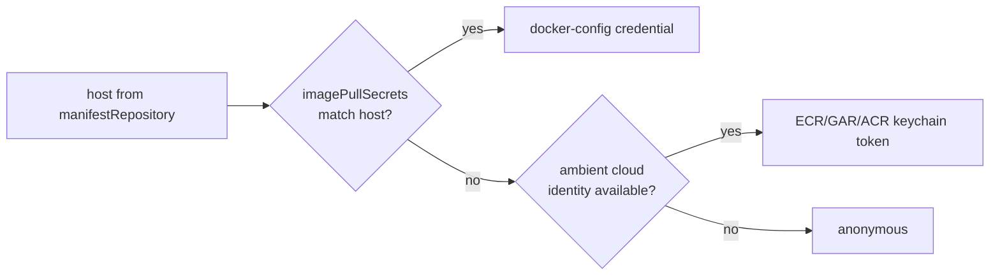
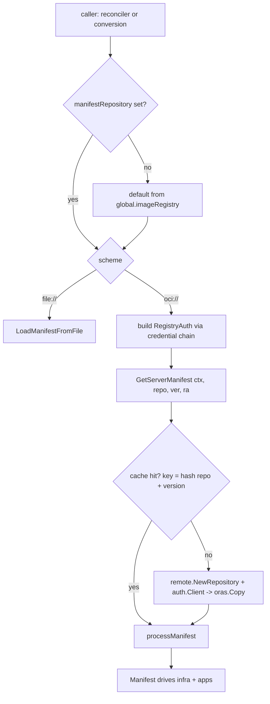

# Server manifest retrieval from private registries

## Problem

The operator resolves a version-specific **server manifest** (an OCI artifact)
and uses it to drive the entire reconcile — infra sizing, generated secrets,
Kafka topics, migrations, and every application. Today that artifact can only be
pulled **anonymously** or from a `file://` path: `DownloadServerManifest` builds
its ORAS remote with `remote.NewRepository(repository)` and never sets a client,
so every request authenticates as `EmptyCredential`
([manifest.go:600](../../../pkg/wandb/manifest/manifest.go)).

That works for the public default repository but blocks the supported
private-registry / air-gapped flow. In that flow a customer runs
`wsm registry mirror` to copy **the images and the server manifest into one
private registry**; the manifest lands next to the images at
`<imageRegistry>/wandb/server-manifest`. The operator can already retarget image
pulls to that registry (`spec.global.imageRegistry`, applied via
`ImageRef.GetImage` at [pods.go:50](../../../internal/controller/reconciler/pods.go)),
but it cannot pull the *manifest* from there because:

- it does not derive the manifest location from `imageRegistry`, and
- it cannot present credentials for a private registry (basic or cloud-ambient).

We want a single, kubelet-consistent registry-credentials story: **the same
credential a customer already needs for image pulls also authenticates the
operator's manifest pull**, with anonymous remaining the zero-config default and
the v1→v2 conversion webhook working in the same scenarios the reconciler does.

## Background: how manifests, images, and credentials flow today

**Manifest resolution.** `manifest.GetServerManifest(ctx, repository, version)`
([manifest.go:296](../../../pkg/wandb/manifest/manifest.go)) switches on scheme:
`file://` → local load; `oci://` (default) → `DownloadServerManifest`
(anonymous); `http/https` → unimplemented. `DownloadServerManifest` caches into a
**single shared** on-disk ORAS store at `/tmp/server-manifest`, keyed **only by
the `version` tag** ([manifest.go:590,597](../../../pkg/wandb/manifest/manifest.go)).

**The manifest lives next to the images.** The default manifest repo is exactly
`<default imageRegistry>` + `/wandb/server-manifest`:

```
DefaultManifestRepository = oci://us-docker.pkg.dev/wandb-production/public/wandb/server-manifest
                                  └────────── spec.global.imageRegistry ─────────┘ └── suffix ──┘
```

([weightsandbiases_types.go:392](../../../api/v2/weightsandbiases_types.go);
the v1 default sets `imageRegistry: us-docker.pkg.dev/wandb-production/public`,
[wandb-default-v1.yaml:20](../../../hack/testing-manifests/wandb/wandb-default-v1.yaml)).

**Image pulls.** Every workload image is retargeted with
`GetImage(wandb.Spec.Global.ImageRegistry)`
([pods.go:50,80,124](../../../internal/controller/reconciler/pods.go)). There is
**no `imagePullSecrets` field in the CRD** and none is set on any generated
PodSpec or on the workload ServiceAccount ([rbac.go:28](../../../internal/controller/reconciler/rbac.go));
image pulls rely on ambient node/SA identity today.

**Two manifest callers, both with a k8s reader available:**

- **Reconciler** — [reconcile_v2.go:293](../../../internal/controller/reconciler/reconcile_v2.go).
  Full `client.Client` + CR namespace in scope.
- **v1→v2 conversion webhook** — `legacyManifestApps`
  ([weightsandbiases_conversion_overrides.go:74](../../../api/v1/weightsandbiases_conversion_overrides.go)).
  It **already has an injected reader**: `conversionReader`
  (`SetConversionReader(mgr.GetAPIReader())`, wired at
  [main.go:359](../../../cmd/manager/main.go)) and already reads a Secret via
  `lookupSecret` to resolve values
  ([weightsandbiases_conversion.go:45-93](../../../api/v1/weightsandbiases_conversion.go)).
  It is intentionally best-effort — a 15s timeout + per-key failure cooldown so a
  manifest fetch never stalls a v1 read/write.

**Existing precedent.** Private-registry auth for OCI Helm charts already exists
via `charts.CredentialSecret`
([charts/oci.go:167](../../../pkg/wandb/spec/charts/oci.go)).

## Goals

- Pull the server manifest from a private OCI registry using **the same
  credential that pulls the images** — a `kubernetes.io/dockerconfigjson` pull
  secret referenced from `spec.global.imagePullSecrets`.
- Pull the server manifest using **ambient cloud credentials** (ECR / Artifact
  Registry / ACR) from the operator pod's identity, with no secret configured.
- **Propagate `spec.global.imagePullSecrets` to workload pods** so the images the
  manifest names pull from the same private registry with the same credential.
- Default `spec.wandb.manifestRepository` from `spec.global.imageRegistry`
  (`oci://<imageRegistry>/wandb/server-manifest`); keep `manifestRepository` as an
  explicit override for relocating **only** the manifest.
- Make the **conversion webhook** resolve the manifest in the same scenarios as
  the reconciler (see [conversion section](#bringing-the-conversion-webhook-fully-in-scope)).
- Keep **anonymous** the default; fix the `/tmp/server-manifest` cache so a
  private artifact can never be served to a CR that lacks access.

## Non-goals

- **`http`/`https` (non-OCI) manifest sources** — still unimplemented.
- **mTLS / client-certificate registry auth.** Deferred; the transport hook
  exists (Open questions). Private-CA-over-HTTPS is already handled for the
  operator's egress via the chart's `wandb-operator.caCerts`
  ([README](../../../README.md)).
- **A manifest-specific credential field.** Not needed: when a customer relocates
  *only* the manifest to a different registry, they add that registry's entry to
  `spec.global.imagePullSecrets` (the credential chain matches by host — see
  below). Revisit only if a concrete case needs manifest-only creds.

## Design

### Registry location: `imageRegistry` drives the manifest-repository default

`wsm registry mirror` puts the manifest at `<imageRegistry>/wandb/server-manifest`,
so the default follows the mirror automatically. In the defaulting webhook
([weightsandbiases_webhook.go:100](../../../internal/webhook/v2/weightsandbiases_webhook.go)),
when `spec.wandb.manifestRepository` is unset:

```go
if wandb.Spec.Wandb.ManifestRepository == "" {
    reg := wandb.Spec.Global.ImageRegistry
    if reg == "" {
        reg = appsv2.DefaultImageRegistry // "us-docker.pkg.dev/wandb-production/public"
    }
    wandb.Spec.Wandb.ManifestRepository = "oci://" + reg + "/" + appsv2.ManifestRepositorySuffix // "wandb/server-manifest"
}
```

Refactor the existing constant so the relationship is explicit and reusable by
both the webhook and v1 conversion:

```go
const (
    DefaultImageRegistry      = "us-docker.pkg.dev/wandb-production/public"
    ManifestRepositorySuffix  = "wandb/server-manifest"
    DefaultManifestRepository = "oci://" + DefaultImageRegistry + "/" + ManifestRepositorySuffix
)
```

An explicit `manifestRepository` always wins (the manifest-only-override case).

### One credential for two pulls: `imagePullSecrets`

Add the standard Kubernetes shape to `GlobalSpec`
([weightsandbiases_types.go:143](../../../api/v2/weightsandbiases_types.go)):

```go
// ImagePullSecrets references kubernetes.io/dockerconfigjson Secrets in the W&B
// namespace. Used BOTH to authenticate the operator's server-manifest pull and,
// propagated onto workloads, to authenticate their image pulls.
// +optional
ImagePullSecrets []corev1.LocalObjectReference `json:"imagePullSecrets,omitempty"`
```

One secret, two consumers:

1. **Operator → manifest pull.** The reconciler reads the referenced
   dockerconfigjson Secret(s) and builds an ORAS credential from them
   (`credentials.NewMemoryStoreFromDockerConfig(bytes)` — in-memory, no disk),
   matched to the registry host in `manifestRepository`.
2. **Kubelet → image pulls.** The reconciler sets `PodSpec.ImagePullSecrets`
   **explicitly on every pod template the operator builds** — the app
   `Application` PodTemplate, the migration and mysql-init Jobs, and every managed
   infra pod (moco MySQL, bufstream Kafka, Altinity ClickHouse + Keeper, opstree
   Redis, SeaweedFS). This is order-independent and works with a bring-your-own
   ServiceAccount, unlike relying on the ServiceAccount admission plugin — which
   would miss the mysql-init Job (runs under the default SA, before the W&B SA
   exists) and every managed-infra pod (own SAs).

This is exactly how a customer already thinks about registry access (one
`kubectl create secret docker-registry`), and it makes the manifest pull and the
image pulls share a single source of truth. A dockerconfigjson may hold multiple
registries, and multiple pull secrets may be listed, so the manifest-only-override
case is covered by adding that registry's entry — no separate field.

### Credential resolution chain (kubelet-style)

The manifest pull resolves credentials per registry host in the same order
kubelet resolves image pulls, expressed as one ORAS `auth.CredentialFunc`:



No auth-mode enum: presence of a matching pull secret selects basic auth;
otherwise the operator's own cloud identity is tried; otherwise anonymous (the
public-repo default). This mirrors kubelet and keeps configuration to the single
`imagePullSecrets` field plus, optionally, nothing at all for ambient/public.

### Wiring auth into the ORAS pull

The single injection point is `remoteRepo.Client`. ORAS v2.6.2 (already pinned)
ships the auth/credentials/retry packages in-tree — **no dependency bump for the
pull mechanics**. `GetServerManifest`/`DownloadServerManifest` gain one options
argument (a struct, so `file://` and anonymous callers stay source-compatible):

```go
// pkg/wandb/manifest/manifest.go — resolved by the caller; no k8s import here.
type RegistryAuth struct {
    Credential auth.CredentialFunc // nil ⇒ anonymous (unchanged)
    PlainHTTP  bool
}

func GetServerManifest(ctx context.Context, repository, version string, ra *RegistryAuth) (Manifest, error)
```

```go
remoteRepo, err := remote.NewRepository(repository)
// ...
if ra != nil {
    remoteRepo.PlainHTTP = ra.PlainHTTP
    if ra.Credential != nil {
        remoteRepo.Client = &auth.Client{
            Client:     retry.DefaultClient,
            Header:     http.Header{"User-Agent": {"wandb-operator"}},
            Cache:      auth.NewCache(), // reuse tokens across manifest+blob requests
            Credential: ra.Credential,
        }
    }
}
```

`auth.Client` negotiates basic vs bearer from the registry's `WWW-Authenticate`
challenge, so the one client serves docker-config basic auth and cloud bearer
tokens alike. The `manifest` package stays k8s-free; the **caller** builds
`RegistryAuth` (from pull secrets and/or the ambient keychain), which is what lets
both the reconciler and the conversion webhook use it.

### Ambient cloud credentials

"Ambient" = present no secret; let the operator pod's cloud identity mint a
registry token. Recommended implementation: import the pure-Go cloud keychains
from `github.com/google/go-containerregistry/pkg/authn`, wrap them in an
`authn.MultiKeychain`, and adapt the resolved `authn.AuthConfig` to an ORAS
`auth.Credential`. These are the same packages `k8schain`, kaniko, and cosign use
for "ambient identity, no imagePullSecret." Trade-off vs bundling
`docker-credential-*` binaries:

| | In-process keychain (recommended) | Bundled helper binaries |
|---|---|---|
| New Go deps | +go-containerregistry, +aws-sdk-go-v2/ecr, +azidentity, +google oauth2 (none present today) | none |
| Image | pure Go, no binaries | +3 per-arch binaries (~10–30 MB each) |
| Refresh | keychain re-resolves per pull | helper re-mints on expiry |
| Testability | inject a fake keychain | behavior behind `exec` |

The base image is `ubi9/ubi-minimal` (`Dockerfile`), which *can* exec binaries —
so bundling is feasible; the decision is dependency weight vs image size +
testability. Per-cloud mechanics and the prerequisites the operator **cannot**
configure itself (customer setup):

| Cloud | Ambient identity | Token flow | Lifetime | Customer prerequisite |
|---|---|---|---|---|
| AWS ECR | IRSA / EKS Pod Identity | `ecr:GetAuthorizationToken` → `AWS:<pass>` | ~12 h | IAM role w/ ECR read; OIDC trust + SA annotation `eks.amazonaws.com/role-arn` |
| GCP Artifact Registry | GKE Workload Identity | metadata → OAuth2 access token | ~1 h | GSA w/ `artifactregistry.reader`; `workloadIdentityUser` binding + SA annotation `iam.gke.io/gcp-service-account` |
| Azure ACR | Entra Workload / Managed Identity | AAD → `oauth2/exchange` → ACR token | AAD ~1 h | Identity w/ `AcrPull`; federated credential + SA labels `azure.workload.identity/*` |

Because tokens are short and the operator is long-lived, **re-resolve the
keychain on each fetch**; never cache a resolved token in operator state.

### Bringing the conversion webhook fully in scope

My earlier draft scoped this out on the premise that conversion has no k8s
client. **That premise is wrong**: conversion already holds `conversionReader`
(`mgr.GetAPIReader()`) and already reads Secrets via `lookupSecret`
([weightsandbiases_conversion.go:45-70](../../../api/v1/weightsandbiases_conversion.go)).
So the webhook *can* authenticate a private pull. What actually keeps it limited
today, and why it was deferred:

1. **It targets the wrong place.** `legacyManifestApps` hardcodes
   `DefaultManifestRepository`
   ([conversion_overrides.go:75](../../../api/v1/weightsandbiases_conversion_overrides.go))
   and never derives from `imageRegistry`, so an air-gapped mirror is never even
   attempted.
2. **It wires no auth**, so a private pull 401s.
3. **It runs in the apiserver admission path**, which is latency- and
   robustness-sensitive. It is deliberately best-effort (15s timeout + failure
   cooldown, logs-and-skips) so a slow/failed fetch can't make v1 objects
   unservable. Adding secret reads and cloud-token minting adds latency and
   failure surface to that path — the reason to be careful, not a hard block.
4. **The reader is uncached** (`GetAPIReader`), so per-conversion secret reads hit
   the apiserver directly.

**Options to bring it fully in scope** (not mutually exclusive):

| Option | What | Trade-off |
|---|---|---|
| **A. Full parity** (recommended) | In conversion, derive the repo from the resolved v1 values' `global.image.registry`, read `global.imagePullSecrets` via `lookupSecret`, build the same credential chain (incl. ambient), pass `RegistryAuth` to the getter. | Complete — works in every scenario the reconciler does. Adds latency/complexity to admission; keep the existing best-effort timeout + cooldown. |
| **B. Shrink the dependency** | Conversion only needs the app-name→`legacyKey` map. Cache the last-successful map (or persist it on the CR) so conversion rarely fetches; fall back to it when a fetch fails. | Cuts the hot-path fetch dramatically; a stale map is acceptable for legacy-override mapping. Pairs well with A. |
| **C. Ambient-only** | Support only the keychain path in conversion (needs no secret); basic-auth enrichment stays best-effort until the reconciler runs. | Lightest; covers cloud registries with zero secret reads in admission, but not self-hosted-with-pull-secret. |
| **D. Warm cache** | Have the reconciler pre-populate `/tmp/server-manifest` so conversion gets cache hits. | Cheap mitigation on top of any option; ordering is not guaranteed. |

**Recommendation: A, combined with B and D.** A makes every scenario work; B and
D keep the admission path fast and resilient. Ambient (part of A's chain) needs
no secret and is the natural zero-config path. The credential-resolution logic is
shared with the reconciler by keeping it in a small helper that takes a
`ctrlclient.Reader` + namespace (satisfied by both `client.Client` and
`GetAPIReader()`).

### Manifest resolution flow



### Cache correctness fix (prerequisite)

`/tmp/server-manifest` is a single process-wide ORAS store keyed only by the
`version` tag ([manifest.go:590,597](../../../pkg/wandb/manifest/manifest.go)) —
the repository is not part of the key. Once private registries exist this is an
**authorization/correctness bug**: two CRs with different private repos but the
same `version` tag collide, and the second resolves the first's cached artifact,
skipping the authenticated remote fetch. Fix, shipped **with** this feature:
namespace the cache by repository — `oci.New(filepath.Join(base, hash(repo)))` —
and prefer digest-pinning over the mutable tag.

## Alternatives considered

- **Separate `spec.wandb.manifestRegistry` auth block with a mode enum** (first
  draft). Rejected per design feedback: it duplicates the credential a customer
  already needs for images and diverges from the mirror-everything-together flow.
  `imagePullSecrets` unifies both pulls.
- **Bundle `docker-credential-*` binaries.** Zero adapter code (ORAS execs them
  from a `config.json`), but image bloat, per-arch management, and poor
  testability. Kept as the fallback if the keychain's Go-dependency weight is
  unacceptable.
- **`k8schain` directly.** It resolves imagePullSecrets *and* ambient identity —
  attractive and close to what we want — but pulls the full go-containerregistry
  surface; we take just the `authn` keychains plus our own pull-secret reader to
  keep control of caching and errors. Revisit if maintaining the chain ourselves
  proves fiddly.
- **Synthesize a dockerconfigjson from username/password in the CR.** Convenience
  only; referencing an existing `kubernetes.io/dockerconfigjson` secret is the
  standard k8s primitive and avoids the operator minting secrets.

## Security considerations

- Credentials live only in namespaced dockerconfigjson Secrets or the pod's cloud
  identity — never in the CR spec/status or logs. The operator already has
  `secrets` RBAC ([role.yaml:17](../../../config/rbac/role.yaml)); no new grant.
- `auth.Client.validateRealm` rejects bearer-token realms pointing at
  loopback/link-local/private IPs on a host other than the registry (SSRF guard),
  relevant for private registries over HTTPS.
- The cache fix is a security fix (cross-tenant artifact leakage), not just
  correctness.
- Propagating `imagePullSecrets` widens where a pull secret is referenced (every
  workload SA); it references, not copies, the secret and stays in-namespace.

## Testing

- **Unit (`pkg/wandb/manifest`)**: `RegistryAuth` plumbing — nil ⇒ anonymous
  (unchanged); credential func sets basic vs bearer; `PlainHTTP` propagates.
- **Unit (credential chain)**: pull-secret host match → docker-config cred;
  no match + fake keychain → ambient; neither → anonymous. Shared helper tested
  against both a `client.Client` and a bare `Reader`.
- **Unit (defaulting)**: `manifestRepository` derived from `imageRegistry`;
  explicit override wins; default when both unset.
- **Unit (cache)**: two repos + same version tag must not collide (regress the
  bug).
- **Unit (conversion)**: `legacyManifestApps` derives repo + reads pull secret via
  `conversionReader`; fetch failure still logs-and-skips within the cooldown.
- **Reconciler**: `imagePullSecrets` land on the workload SA + migration Jobs.
- **envtest/e2e**: a local `registry:2` behind htpasswd serving a manifest;
  assert authenticated pull and authenticated image pull. Ambient paths validated
  manually per cloud (documented, not CI-gated).
- `make lint` + `make test` before completion (per CLAUDE.md); after the
  `api/v2` edits run `make manifests generate sync-crd-embed`.

## Implementation plan

### Step 0 — Cache correctness fix
Namespace `/tmp/server-manifest` by repository hash in `DownloadServerManifest`;
regress the same-version-different-repo collision.

### Step 1 — `manifest` package auth plumbing
Add `RegistryAuth` + the options arg to `GetServerManifest`/`DownloadServerManifest`;
set `remoteRepo.Client`/`PlainHTTP`. Keep `file://`/anonymous byte-for-byte.

### Step 2 — Constants + defaulting
Refactor `DefaultImageRegistry`/`ManifestRepositorySuffix`/`DefaultManifestRepository`;
default `manifestRepository` from `imageRegistry` in the webhook.

### Step 3 — `spec.global.imagePullSecrets` + workload propagation
Add the field; `make manifests generate sync-crd-embed`. Attach to the workload
ServiceAccount and to migration Jobs / managed-infra PodSpecs. v1 conversion maps
`global.imagePullSecrets` from helm values.

### Step 4 — Credential chain (reconciler)
Shared `ResolveRegistryAuth(ctx, r ctrlclient.Reader, ns, repo, pullSecrets, ambient)`
helper: dockerconfig-from-pull-secrets → ambient keychain → anonymous. Wire at
[reconcile_v2.go:293](../../../internal/controller/reconciler/reconcile_v2.go).

### Step 5 — Ambient keychain (Strategy B)
Add the go-containerregistry `authn` cloud keychains + ORAS adapter; new `go.mod`
deps. Document IRSA / Workload Identity / federated-credential prerequisites.

### Step 6 — Conversion webhook parity
Apply the shared helper + `imageRegistry` defaulting in `legacyManifestApps`
using `conversionReader`; keep the best-effort timeout/cooldown; add the
last-successful-map fallback (Option B).

### Step 7 — Docs & verification
config-api + a private-registry/air-gap how-to; local-registry e2e fixture;
`make lint` + `make test`.

## Resolved design decisions

- **`imageRegistry` defaults `manifestRepository`** (`oci://<imageRegistry>/wandb/server-manifest`);
  explicit `manifestRepository` overrides. Mirrors the `wsm` flow.
- **`spec.global.imagePullSecrets` is the single registry credential**, used for
  the operator's manifest pull *and* propagated to workloads. No separate
  manifest auth field, no auth-mode enum.
- **Credential resolution is a kubelet-style chain**: pull-secret → ambient cloud
  identity → anonymous, matched per host.
- **Conversion webhook is in scope** (it already has a reader); reuse the shared
  credential helper, stay best-effort, add a cached-map fallback.
- **Credentials resolved at the caller; `manifest` stays k8s-free.**
- **ORAS in-tree auth** — no dependency bump for pull mechanics.
- **Cache fix ships with the feature** as a security fix.

## Open questions

1. ~~Ambient strategy: keychain vs bundled helper binaries.~~ **Resolved &
   implemented (keychain):** `registryauth/ambient.go` composes the go-containerregistry
   `authn` cloud keychains (ECR, ACR, GAR) into a `MultiKeychain` adapted to an
   ORAS credential. Pure-Go; adds `go-containerregistry`, `amazon-ecr-credential-helper/ecr-login`,
   and `docker-credential-acr-env` (+ transitive cloud SDKs) to `go.mod`. Ambient
   is gated to non-default (private) registries so the public default never probes
   cloud metadata. Not yet exercised against a live cloud — validate per-cloud
   before GA.
2. ~~imagePullSecrets propagation target.~~ **Resolved:** explicit
   `PodSpec.ImagePullSecrets` on every operator-built pod (app, migration,
   mysql-init, and all managed infra + Keeper). The SA-admission approach was
   rejected — it missed the mysql-init Job and managed-infra pods, and broke with
   a bring-your-own SA.
3. **Conversion admission cost.** Is per-conversion secret read acceptable in the
   apiserver path (bounded by a single 5s timeout across all reads), or should we
   still add Option B (cached map)? Current impl does the read; verified not a
   DoS in review.
4. **mTLS / private-CA registries.** The `auth.Client.Client` transport is the
   hook; should it reuse the chart's `wandb-operator.caCerts` (operator egress
   trust) automatically?
5. ~~Migration images use `GetImage("")`.~~ **Fixed:** migration images now
   retarget to `imageRegistry` like app images
   ([reconcile_v2.go](../../../internal/controller/reconciler/reconcile_v2.go)).
