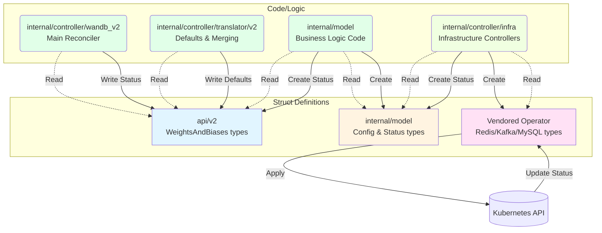

# Struct Usage Graph v2 (Mermaid Diagrams)

This document contains Mermaid diagrams visualizing struct usage across the wandb operator codebase with clear separation between struct definitions (data) and code that operates on them (logic).

## Node Shape Legend

- **Rectangles** [Rectangle] - **Struct definitions** (data types)
- **Rounded rectangles** (Rounded) - **Code/Logic** that operates on structs (functions, controllers, files)
- **Cylinders** [(Database)] - External systems (Kubernetes API)

## Line Style Legend

- **Dotted lines** (⋯→) - **READ** operations (reading struct fields)
- **Solid lines** (→) - **WRITE** operations (creating/modifying structs)
- **Thick lines** (═→) - **READ+WRITE** operations (both reading and writing)

## Table of Contents
- [High-Level Overview](#high-level-overview)
- [MySQL Infrastructure Flow](#mysql-infrastructure-flow)
- [Redis Infrastructure Flow](#redis-infrastructure-flow)
- [Package Dependencies](#package-dependencies)

---

## High-Level Overview

This diagram shows the major components separating struct definitions from code that operates on them.



---

## MySQL Infrastructure Flow

```mermaid
graph TD
    subgraph "api/v2 - Struct Definitions"
        WBMySQLSpec["WBMySQLSpec"]
        WBMySQLConfig["WBMySQLConfig"]
        WBMySQLStatus["WBMySQLStatus"]
        WBMySQLConnection["WBMySQLConnection"]
    end
    
    subgraph "internal/controller/translator/v2 - Code"
        MySQLTranslator("mysql.go<br/>BuildMySQLSpec<br/>BuildMySQLDefaults")
    end
    
    subgraph "internal/model - Struct Definitions"
        MySQLConfig["MySQLConfig"]
        MySQLSizeConfig["MySQLSizeConfig"]
        MySQLConnInfo["MySQLConnInfo"]
        MySQLConnDetail["MySQLConnDetail"]
        MySQLStatusDetail["MySQLStatusDetail"]
        MySQLInfraError["MySQLInfraError"]
    end
    
    subgraph "internal/model - Code"
        MySQLModel("mysql.go<br/>NewMySQLConfig<br/>ToConnInfo<br/>ToStatus")
    end
    
    subgraph "internal/controller/infra/mysql/percona - Code"
        PerconaDesired("desired.go<br/>BuildPXC")
        PerconaActual("actual.go<br/>GetActual")
    end
    
    subgraph "internal/vendored/percona-operator - Struct Definitions"
        PXC["PerconaXtraDBCluster"]
        PXCSpec["PerconaXtraDBClusterSpec"]
        PXCStatus["PerconaXtraDBClusterStatus"]
        PXCNode["PXCSpec"]
        ProxySQL["ProxySQLSpec"]
        HAProxy["HAProxySpec"]
        BackupStorage["BackupStorageSpec"]
    end
    
    %% Translator reads API structs
    MySQLTranslator -.->|Read| WBMySQLSpec
    MySQLTranslator -.->|Read| WBMySQLConfig
    
    %% Translator writes defaults back to API structs
    MySQLTranslator -->|Write Defaults| WBMySQLSpec
    MySQLTranslator -->|Write Defaults| WBMySQLConfig
    
    %% Model reads API structs
    MySQLModel -.->|Read| WBMySQLSpec
    MySQLModel -.->|Read| WBMySQLConfig
    
    %% Model creates model structs
    MySQLModel -->|Create| MySQLConfig
    MySQLModel -->|Create| MySQLSizeConfig
    
    %% Model creates connection info
    MySQLModel -.->|Read| MySQLConfig
    MySQLModel -->|Create| MySQLConnInfo
    MySQLModel -->|Create| MySQLConnDetail
    
    %% Infra reads model structs
    PerconaDesired -.->|Read| MySQLConfig
    
    %% Infra creates vendor structs
    PerconaDesired -->|Create| PXC
    PerconaDesired -->|Create| PXCSpec
    PerconaDesired -->|Create| PXCNode
    PerconaDesired -->|Create| ProxySQL
    PerconaDesired -->|Create| HAProxy
    PerconaDesired -->|Create| BackupStorage
    
    %% Infra reads actual vendor structs
    PerconaActual -.->|Read| PXC
    PerconaActual -.->|Read| PXCStatus
    
    %% Infra creates status
    PerconaActual -->|Create| MySQLStatusDetail
    
    %% Model converts status
    MySQLModel -.->|Read| MySQLStatusDetail
    MySQLModel -->|Convert| WBMySQLStatus
    
    MySQLModel -.->|Read| MySQLConnInfo
    MySQLModel -->|Convert| WBMySQLConnection
    
    style WBMySQLSpec fill:#e1f5ff
    style WBMySQLConfig fill:#e1f5ff
    style WBMySQLStatus fill:#e1f5ff
    style WBMySQLConnection fill:#e1f5ff
    style MySQLConfig fill:#fff4e1
    style MySQLSizeConfig fill:#fff4e1
    style MySQLConnInfo fill:#fff4e1
    style MySQLConnDetail fill:#fff4e1
    style MySQLStatusDetail fill:#fff4e1
    style MySQLInfraError fill:#fff4e1
    style PXC fill:#ffe1f5
    style PXCSpec fill:#ffe1f5
    style PXCStatus fill:#ffe1f5
    style PXCNode fill:#ffe1f5
    style ProxySQL fill:#ffe1f5
    style HAProxy fill:#ffe1f5
    style BackupStorage fill:#ffe1f5
```



---

## Redis Infrastructure Flow

```mermaid
graph TD
    subgraph "api/v2 - Struct Definitions"
        WBRedisSpec["WBRedisSpec"]
        WBRedisConfig["WBRedisConfig"]
        WBRedisSentinelSpec["WBRedisSentinelSpec"]
        WBRedisSentinelConfig["WBRedisSentinelConfig"]
        WBRedisStatus["WBRedisStatus"]
        WBRedisConnection["WBRedisConnection"]
    end
    
    subgraph "internal/controller/translator/v2 - Code"
        RedisTranslator("redis.go<br/>BuildRedisSpec<br/>BuildRedisDefaults")
    end
    
    subgraph "internal/model - Struct Definitions"
        RedisConfig["RedisConfig"]
        SentinelConfig["sentinelConfig"]
        RedisSentinelConnInfo["RedisSentinelConnInfo"]
        RedisSentinelConnDetail["RedisSentinelConnDetail"]
        RedisStandaloneConnInfo["RedisStandaloneConnInfo"]
        RedisStandaloneConnDetail["RedisStandaloneConnDetail"]
        RedisStatusDetail["RedisStatusDetail"]
        RedisInfraError["RedisInfraError"]
    end
    
    subgraph "internal/model - Code"
        RedisModel("redis.go<br/>NewRedisConfig<br/>ToConnInfo<br/>ToStatus")
    end
    
    subgraph "internal/controller/infra/redis/opstree - Code"
        OpstreeDesired("desired.go<br/>BuildRedis<br/>BuildSentinel")
        OpstreeActual("actual.go<br/>GetActual")
    end
    
    subgraph "internal/vendored/redis-operator - Struct Definitions"
        Redis["Redis"]
        RedisSpec["RedisSpec"]
        RedisStatus["RedisStatus"]
        RedisSentinel["RedisSentinel"]
        RedisSentinelSpec["RedisSentinelSpec"]
        RedisSentinelStatus["RedisSentinelStatus"]
        KubernetesConfig["KubernetesConfig"]
        Storage["Storage"]
        RedisExporter["RedisExporter"]
    end
    
    %% Translator reads API structs
    RedisTranslator -.->|Read| WBRedisSpec
    RedisTranslator -.->|Read| WBRedisConfig
    RedisTranslator -.->|Read| WBRedisSentinelSpec
    RedisTranslator -.->|Read| WBRedisSentinelConfig
    
    %% Translator writes defaults
    RedisTranslator -->|Write Defaults| WBRedisSpec
    RedisTranslator -->|Write Defaults| WBRedisConfig
    RedisTranslator -->|Write Defaults| WBRedisSentinelSpec
    RedisTranslator -->|Write Defaults| WBRedisSentinelConfig
    
    %% Model reads API structs
    RedisModel -.->|Read| WBRedisSpec
    RedisModel -.->|Read| WBRedisConfig
    RedisModel -.->|Read| WBRedisSentinelSpec
    RedisModel -.->|Read| WBRedisSentinelConfig
    
    %% Model creates model structs
    RedisModel -->|Create| RedisConfig
    RedisModel -->|Create| SentinelConfig
    
    %% Model creates connection info
    RedisModel -.->|Read| RedisConfig
    RedisModel -->|Create| RedisSentinelConnInfo
    RedisModel -->|Create| RedisSentinelConnDetail
    RedisModel -->|Create| RedisStandaloneConnInfo
    RedisModel -->|Create| RedisStandaloneConnDetail
    
    %% Infra reads model structs
    OpstreeDesired -.->|Read| RedisConfig
    
    %% Infra creates vendor structs
    OpstreeDesired -->|Create Standalone| Redis
    OpstreeDesired -->|Create Standalone| RedisSpec
    OpstreeDesired -->|Create Sentinel| RedisSentinel
    OpstreeDesired -->|Create Sentinel| RedisSentinelSpec
    OpstreeDesired -->|Create| KubernetesConfig
    OpstreeDesired -->|Create| Storage
    OpstreeDesired -->|Create| RedisExporter
    
    %% Infra reads actual vendor structs
    OpstreeActual -.->|Read| Redis
    OpstreeActual -.->|Read| RedisSentinel
    OpstreeActual -.->|Read| RedisStatus
    OpstreeActual -.->|Read| RedisSentinelStatus
    
    %% Infra creates status
    OpstreeActual -->|Create| RedisStatusDetail
    
    %% Model converts status
    RedisModel -.->|Read| RedisStatusDetail
    RedisModel -->|Convert| WBRedisStatus
    
    RedisModel -.->|Read| RedisSentinelConnInfo
    RedisModel -.->|Read| RedisStandaloneConnInfo
    RedisModel -->|Convert| WBRedisConnection
    
    style WBRedisSpec fill:#e1f5ff
    style WBRedisConfig fill:#e1f5ff
    style WBRedisSentinelSpec fill:#e1f5ff
    style WBRedisSentinelConfig fill:#e1f5ff
    style WBRedisStatus fill:#e1f5ff
    style WBRedisConnection fill:#e1f5ff
    style RedisConfig fill:#fff4e1
    style SentinelConfig fill:#fff4e1
    style RedisSentinelConnInfo fill:#fff4e1
    style RedisSentinelConnDetail fill:#fff4e1
    style RedisStandaloneConnInfo fill:#fff4e1
    style RedisStandaloneConnDetail fill:#fff4e1
    style RedisStatusDetail fill:#fff4e1
    style RedisInfraError fill:#fff4e1
    style Redis fill:#ffe1f5
    style RedisSpec fill:#ffe1f5
    style RedisStatus fill:#ffe1f5
    style RedisSentinel fill:#ffe1f5
    style RedisSentinelSpec fill:#ffe1f5
    style RedisSentinelStatus fill:#ffe1f5
    style KubernetesConfig fill:#ffe1f5
    style Storage fill:#ffe1f5
    style RedisExporter fill:#ffe1f5
```



---

## Package Dependencies

This diagram shows which packages define structs versus which contain code that operates on them.

```mermaid
graph TB
    subgraph "api/v2"
        APIStructs["Struct Definitions<br/>39 types"]
    end
    
    subgraph "internal/model"
        ModelStructs["Struct Definitions<br/>34 types"]
        ModelCode("Business Logic Code<br/>mysql.go, redis.go, etc.")
    end
    
    subgraph "internal/controller/wandb_v2"
        ControllerCode("Main Reconciler<br/>weightsandbiases_v2_controller.go<br/>mysql.go, redis.go, etc.")
    end
    
    subgraph "internal/controller/translator/v2"
        TranslatorCode("Translators<br/>mysql.go, redis.go, etc.")
    end
    
    subgraph "internal/controller/infra"
        InfraCode("Infrastructure Controllers<br/>mysql/percona, redis/opstree, etc.")
    end
    
    subgraph "Vendored Operators"
        RedisOpStructs["redis-operator<br/>30 struct types"]
        MinioOpStructs["minio-operator<br/>26 struct types"]
        KafkaOpStructs["strimzi-kafka<br/>36 struct types"]
        MySQLOpStructs["percona-operator<br/>46 struct types"]
        ClickHouseOpStructs["altinity-clickhouse<br/>70+ struct types"]
    end
    
    %% Controller reads/writes API structs
    ControllerCode -.->|Read| APIStructs
    ControllerCode -->|Write Status| APIStructs
    
    %% Translator reads/writes API structs
    TranslatorCode -.->|Read| APIStructs
    TranslatorCode -->|Write Defaults| APIStructs
    
    %% Model code reads API structs and creates model structs
    ModelCode -.->|Read| APIStructs
    ModelCode -->|Create| ModelStructs
    ModelCode -->|Create Status| APIStructs
    
    %% Infra reads model structs
    InfraCode -.->|Read| ModelStructs
    
    %% Infra creates vendor structs
    InfraCode -->|Create| MySQLOpStructs
    InfraCode -->|Create| RedisOpStructs
    InfraCode -->|Create| KafkaOpStructs
    InfraCode -->|Create| MinioOpStructs
    InfraCode -->|Create| ClickHouseOpStructs
    
    %% Infra reads vendor structs
    InfraCode -.->|Read| MySQLOpStructs
    InfraCode -.->|Read| RedisOpStructs
    InfraCode -.->|Read| KafkaOpStructs
    InfraCode -.->|Read| MinioOpStructs
    InfraCode -.->|Read| ClickHouseOpStructs
    
    %% Infra creates status back to model
    InfraCode -->|Create Status| ModelStructs
    
    style APIStructs fill:#e1f5ff
    style ModelStructs fill:#fff4e1
    style RedisOpStructs fill:#ffe1f5
    style MinioOpStructs fill:#ffe1f5
    style KafkaOpStructs fill:#ffe1f5
    style MySQLOpStructs fill:#ffe1f5
    style ClickHouseOpStructs fill:#ffe1f5
    style ControllerCode fill:#e1ffe8
    style TranslatorCode fill:#e1ffe8
    style ModelCode fill:#e1ffe8
    style InfraCode fill:#f0ffe1
```



---

## Updating Instructions

This document was generated through analysis of the codebase. To update it:

### When to Update

Update this document when:
- New struct types are added to any of the analyzed packages
- New packages with structs are introduced
- Code files that read/write structs are added or significantly refactored
- Infrastructure integrations change (new vendored operators, etc.)

### How to Update

1. **Identify the scope of changes**:
   - Which packages have new struct definitions?
   - Which code files now read/write those structs?
   - Have any data flows changed?

2. **Update the relevant diagram(s)**:
   - For new structs in existing packages: Add them to the appropriate subgraph
   - For new code files: Add them as rounded rectangle nodes `("filename.go<br/>FunctionName")`
   - For new struct definitions: Add them as rectangle nodes `["StructName"]`

3. **Update arrows**:
   - **Read operations**: Code reads struct: `(Code) -.->|Read| ["Struct"]`
   - **Write operations**: Code creates/modifies struct: `(Code) -->|Write/Create| ["Struct"]`
   - Remember: arrows point FROM code TO structs for both reads and writes

4. **Verify node shapes**:
   - Struct definitions use square brackets: `["StructName"]`
   - Code/logic uses parentheses: `("filename.go<br/>Function")`
   - External systems use cylinder syntax: `[("System Name")]`

5. **Update the statistics** at the bottom if struct counts change

### Reference Commands for Analysis

To analyze struct usage for updates, use these commands:

```bash
# Find all struct definitions in a package
grep -rn "^type.*struct {" api/v2/

# Find where a specific struct is used (reads)
grep -rn "\.MySQLConfig" internal/

# Find where a struct is instantiated (writes)
grep -rn "MySQLConfig{" internal/

# Find method receivers (code that operates on structs)
grep -rn "func (.*MySQLConfig)" internal/

# List all struct definitions with line numbers
find api/v2 internal/model internal/vendored -name "*.go" -exec grep -Hn "^type.*struct {" {} \;
```

### Source Document

This graph was generated from analysis captured in:
- `struct_usage_mapping.md` - Detailed text-based mapping of all struct definitions and usage

For major updates, regenerate the analysis using the agent workflow documented in that file.

---

## Viewing Instructions

To view these diagrams:

1. **GitHub**: GitHub natively renders Mermaid diagrams in markdown files
2. **VS Code**: Install the "Markdown Preview Mermaid Support" extension
3. **Online**: Copy diagram code to https://mermaid.live/
4. **IntelliJ/GoLand**: Built-in Mermaid support in markdown preview
5. **CLI**: Use `mmdc` (mermaid-cli) to generate PNG/SVG:
   ```bash
   npm install -g @mermaid-js/mermaid-cli
   mmdc -i struct_usage_graph.md -o struct_usage_graph.png
   ```

## Node Shape Legend (Reminder)

- **Rectangles** [Rectangle] - **Struct definitions** (data types)
- **Rounded rectangles** (Rounded) - **Code/Logic** that operates on structs

## Line Style Legend (Reminder)

- **Dotted lines** (⋯→) - **READ** operations
- **Solid lines** (→) - **WRITE** operations  
- **Thick lines** (═→) - **READ+WRITE** operations

## Color Legend

- 🔵 **Blue** (`#e1f5ff`) - API struct types (api/v2)
- 🟡 **Yellow** (`#fff4e1`) - Model struct types (internal/model)
- 🟢 **Green** (`#e1ffe8`) - Controller/Translator code (internal/controller)
- 🟣 **Purple** (`#ffe1f5`) - Vendored operator struct types
- 🌱 **Light Green** (`#f0ffe1`) - Infrastructure controller code

## Key Insights

### Data vs Logic Separation

Each package that has both struct definitions AND code that operates on them is now represented twice:

1. **internal/model**:
   - **Struct Definitions**: MySQLConfig, RedisConfig, etc. (yellow rectangles)
   - **Business Logic Code**: mysql.go, redis.go functions (green rounded rectangles)

2. **api/v2**:
   - **Struct Definitions**: WBMySQLSpec, WBRedisSpec, etc. (blue rectangles)
   - No code nodes (only contains struct definitions)

3. **internal/controller/infra**:
   - No struct definitions
   - **Code Only**: desired.go, actual.go (light green rounded rectangles)

4. **Vendored operators**:
   - **Struct Definitions Only**: PerconaXtraDBCluster, Redis, Kafka, etc. (purple rectangles)
   - No code (we don't control their code)

### Flow Pattern

1. **API Structs** (rectangles) → **Translator Code** (rounded) → **API Structs** (updated)
2. **API Structs** (rectangles) → **Model Code** (rounded) → **Model Structs** (rectangles)
3. **Model Structs** (rectangles) → **Infra Code** (rounded) → **Vendor Structs** (rectangles)
4. **Vendor Structs** (rectangles) → **Infra Code** (rounded) → **Model Structs** (rectangles) → **API Structs** (rectangles)

This clearly shows:
- **Data** flows through rectangles (struct definitions)
- **Transformations** happen in rounded rectangles (code/logic)
- **Reads** are dotted (consumption)
- **Writes** are solid (creation/mutation)

## Summary Statistics

- **Total Packages with Structs**: 8
- **Total Packages with Code**: 5
- **Packages with Both**: 1 (internal/model)
- **Total Structs Mapped**: 280+
- **API Structs (api/v2)**: 39
- **Model Structs (internal/model)**: 34
- **Vendored Operator Structs**: 208+
