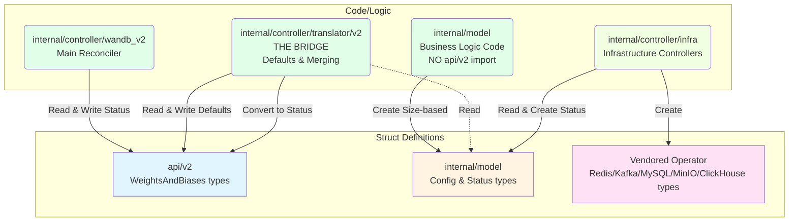

# Struct Usage Graph v2

This document visualizes struct usage across the wandb operator codebase with clear separation between struct definitions (data) and code that operates on them (logic).

## Node Shape Legend

- **Rectangles** [Rectangle] - **Struct definitions** (data types)
- **Rounded rectangles** (Rounded) - **Code/Logic** that operates on structs (functions, controllers, files)

## Line Style Legend

- **Dotted lines** (⋯→) - **READ** operations (reading struct fields)
- **Solid lines** (→) - **WRITE** operations (creating/modifying structs)

## Color Legend

- 🔵 **Blue** (`#e1f5ff`) - API struct types (api/v2)
- 🟡 **Yellow** (`#fff4e1`) - Model struct types (internal/model)
- 🟣 **Purple** (`#ffe1f5`) - Vendored operator struct types
- 🟢 **Green** (`#e1ffe8`) - Controller/Translator code (internal/controller)
- 🌱 **Light Green** (`#f0ffe1`) - Infrastructure controller code

---

## High-Level Overview

This diagram shows the major components separating struct definitions from code that operates on them.



---

## Key Insights

### Data vs Logic Separation

The architecture maintains clear separation:

1. **api/v2**: Kubernetes API types (user-facing struct definitions)
2. **internal/controller/translator/v2**: THE BRIDGE - translates between api/v2 and model
3. **internal/model**: Pure business logic (NO api/v2 dependency)
4. **internal/controller/infra**: Infrastructure controllers (model → vendor CRs)
5. **Vendored operators**: External operator CRs (struct definitions only)

### Critical Architectural Principle

**`internal/model` does NOT import `api/v2`** - The translator layer is the ONLY bridge between them.

This design allows `internal/model` to be reused without dragging in Kubernetes dependencies.

### Flow Pattern

1. **User Input** (api/v2) → **Translator** (THE BRIDGE) → **API Structs with defaults**
2. **Translator** → **Model Code** (NO api/v2 access) → **Model Structs** (Size-based configs)
3. **Model Structs** → **Infra Code** → **Vendor Structs**
4. **Vendor Status** → **Infra Code** → **Model Status** → **Translator** → **API Status**

Key principles:
- **Data** flows through rectangles (struct definitions)
- **Transformations** happen in rounded rectangles (code/logic)
- **Reads** are dotted lines (consumption)
- **Writes** are solid lines (creation/mutation)
- **Translator is the bridge** - model does NOT import api/v2

---

## Summary Statistics

### Struct Counts by Package

- **API Structs (api/v2)**: 38 types
- **Model Structs (internal/model)**: 44 types
- **Vendored Operator Structs**: 261 types total
  - Percona MySQL Operator: 48 types
  - Redis Operator (Opstree): 27 types
  - Strimzi Kafka Operator: 37 types
  - MinIO Operator: 26 types
  - Altinity ClickHouse Operator: 123 types

### Infrastructure Components

All 5 infrastructure types follow the same pattern:
1. **MySQL** - Using Percona XtraDB Cluster Operator
2. **Redis** - Using Opstree Redis Operator (standalone + sentinel modes)
3. **Kafka** - Using Strimzi Operator (KRaft mode with node pools)
4. **MinIO** - Using MinIO Operator (tenant-based)
5. **ClickHouse** - Using Altinity ClickHouse Operator

---

## Viewing Instructions

To view this diagram:

1. **GitHub**: GitHub natively renders Mermaid diagrams in markdown files
2. **VS Code**: Install the "Markdown Preview Mermaid Support" extension
3. **Online**: Copy diagram code to https://mermaid.live/
4. **IntelliJ/GoLand**: Built-in Mermaid support in markdown preview
5. **CLI**: Use `mmdc` (mermaid-cli) to generate PNG/SVG:
   ```bash
   npm install -g @mermaid-js/mermaid-cli
   mmdc -i struct_usage_graph.md -o struct_usage_graph.png
   ```

---

## Updating Instructions

### When to Update

Update this document when:
- New packages are added or major architectural changes occur
- The relationship between api/v2, translator, model, or infra changes
- New infrastructure types are added
- The separation of concerns principles change

### How to Update

Follow these steps to regenerate the diagram:

1. **Verify architectural principles** (these are critical):
   - Confirm `internal/model` does NOT import `api/v2` (check imports)
   - Confirm `internal/controller/translator/v2` is THE BRIDGE between api/v2 and model
   - Identify any new code/logic packages or struct definition packages

2. **Identify the major components**:
   - **Struct Definitions** (rectangles): api/v2, internal/model, vendored operators
   - **Code/Logic** (rounded rectangles): Controller, Translator, Model, Infra

3. **Map the data flow** (arrows):
   - Start from user input (api/v2 structs)
   - Follow through Controller → Translator → Model → Infra → Vendors
   - Trace status flow back: Vendors → Infra → Model → Translator → api/v2

4. **Apply arrow rules** (IMPORTANT):
   - **Solid lines** (→): Use when code WRITES to structs (even if it also reads)
   - **Dotted lines** (⋯→): Use ONLY for purely READ-ONLY operations (no writes)
   - **Rule**: If there's a write operation, use solid line only (don't add a dotted read line)
   - Label arrows clearly: "Create", "Read & Write", "Convert to Status", etc.

5. **Verify critical rules**:
   - ✅ NO arrows from Model to APIStructs (model doesn't import api/v2)
   - ✅ Translator is the ONLY bridge between APIStructs and ModelStructs
   - ✅ Only ONE dotted line should exist: Translator reading ModelStructs (read-only)
   - ✅ All other relationships involve writes, so use solid lines

6. **Update statistics**: Recount structs if new types were added

### Reference Commands

```bash
# Verify internal/model does NOT import api/v2 (should return nothing)
grep -n "github.com/wandb/operator/api/v2" internal/common/*.go

# Find all struct definitions in a package
grep -rn "^type.*struct {" api/v2/
grep -rn "^type.*struct {" internal/common/

# Find where a struct is instantiated (writes)
grep -rn "MySQLConfig{" internal/

# Find code that reads from a package
grep -rn "apiv2\." internal/controller/translator/

# Count struct types in a package
grep -c "^type.*struct {" api/v2/*.go
```

### Key Architectural Principles to Preserve

1. **internal/model is decoupled from api/v2**: No imports, no direct references
2. **Translator is THE BRIDGE**: Only translator converts between api/v2 and model types
3. **Clean separation**: Struct definitions (rectangles) vs Code/Logic (rounded rectangles)
4. **Single responsibility**: Each layer has a clear purpose
5. **Simplified diagram**: High-level overview only, no detailed per-infrastructure diagrams

### Source Document

For detailed struct usage mapping, see:
- `struct_usage_mapping.md` - Text-based mapping of all struct definitions and usage
