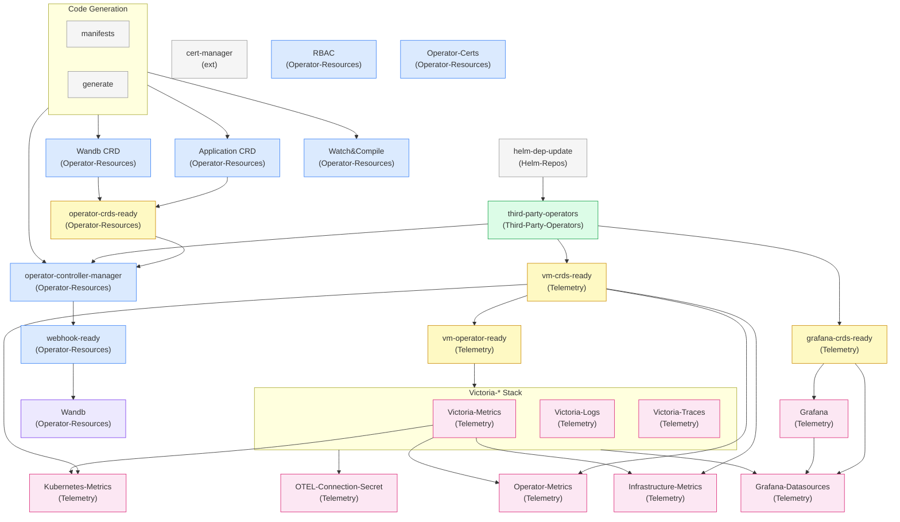

# Tilt Resource Dependency Graph

Resources shown with their labels in parentheses. Telemetry resources are only
active when `installTelemetry: true` and Wandb is only active when
`installWandb: true` in `tilt-settings.json`.

