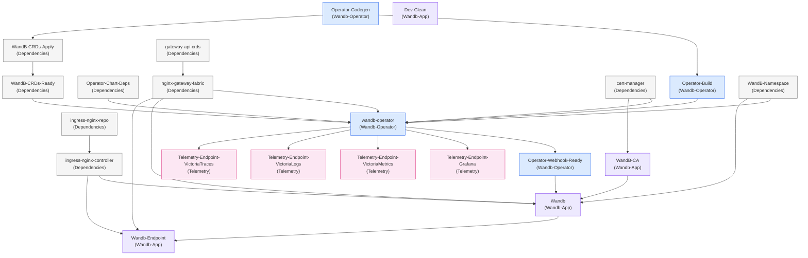

# Tilt Resource Dependency Graph

Resources shown with their labels in parentheses. The default path installs one
`wandb-operator` Helm release, Gateway API networking, an optional W&B CR, and
telemetry disabled.

Conditional resources:

- `Wandb`, `Wandb-Endpoint`, and `WandB-CA` only appear when `includeCR=True`.
- `WandB-Namespace` appears when Tilt needs a W&B namespace for the CR or telemetry resources.
- `gateway-api-crds` and `nginx-gateway-fabric` appear when `networkMode="gateway"`.
- `ingress-nginx-*` appears when `networkMode="ingress"`.
- `Telemetry-Endpoint-*` appears only when `observabilityMode="full"`.

Tilt generates the W&B CR through `go run ./hack/tilt/wandbcr`, then reads the
typed YAML back for the resource name, namespace, networking mode, and endpoint
hostname. The default CR omits `spec.wandb.manifestRepository` so the webhook
uses the published server manifest repository; `manifestSource="local"` mounts
`localManifestPath` into the operator image at `/server-manifest` and writes
`file:///server-manifest` into the generated CR.

