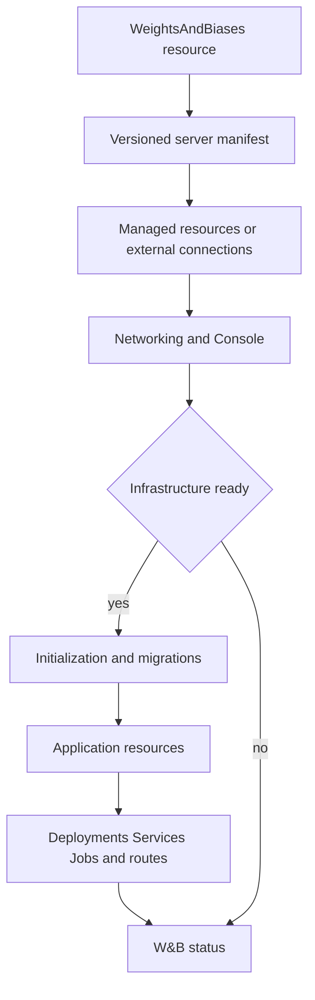

# Operator architecture

Operator is a Kubebuilder/controller-runtime application. The manager watches W&B
resources, reconciles their backing infrastructure, and renders application
workloads from a versioned server manifest.

| Location | Responsibility |
| --- | --- |
| [api/v1](../../api/v1) and [api/v2](../../api/v2) | API types; v2 is the storage/hub version and v1 converts through it |
| [cmd/manager](../../cmd/manager) | Manager entrypoint, controller and webhook registration |
| [cmd/crd-installer](../../cmd/crd-installer) | Chart hook binary for installing/updating embedded CRDs |
| [internal/controller](../../internal/controller) | Top-level W&B and Application controllers and other resource controllers |
| [internal/controller/reconciler](../../internal/controller/reconciler) | W&B reconciliation by concern: infrastructure, networking, migrations, applications, and Console |
| [internal/controller/infra](../../internal/controller/infra) | Managed implementations and external connection resolution |
| [internal/controller/common](../../internal/controller/common) | Shared ownership, naming, retention, and status helpers |
| [internal/webhook/v2](../../internal/webhook/v2) | Defaulting and validation |
| [pkg/wandb/manifest](../../pkg/wandb/manifest) | Manifest loading, image references, and manifest schema |
| [config](../../config) | Kustomize configuration, generated CRDs, webhook and RBAC manifests |
| [deploy/operator](../../deploy/operator) | Published Operator chart and component dependencies |
| [pkg/vendored](../../pkg/vendored) | Third-party API/CRD snapshots; use their colocated update notes |

## Reconciliation flow

The current flow in [reconcile_v2.go](../../internal/controller/reconciler/reconcile_v2.go)
is broadly:

1. Handle deletion and retention finalizers, or normalize legacy conversion state.
2. Resolve the server manifest and the deployment's infrastructure configuration.
3. Reconcile backing services and infer their connection information and status.
4. Publish networking and reconcile Console before the infrastructure readiness gate.
5. Wait for infrastructure, generate required secrets, and complete MySQL initialization.
6. Run the W&B migrations for the requested version.
7. Reconcile Applications, wait for live Deployment readiness, and clean up the
   known obsolete v1 application Deployments.
8. Publish W&B readiness for the observed generation.

Console failures are retried without blocking the rest of W&B reconciliation.
Console readiness does not contribute to the W&B `Ready` condition.

## Managed and external services

Managed services provision resources through Moco, the Redis operator, SeaweedFS,
Altinity ClickHouse, and the Bufstream integration for Kafka. External service
adapters resolve values/Secret references into connection material. MySQL, Redis,
object storage, and ClickHouse are instance maps; `default` is the fallback key.
Kafka is single-instance and managed-only in the current CR API.

Each managed service has its own retention behavior. The W&B finalizer dispatches
the effective per-instance or top-level policy before removing itself. Follow
ownership and connection-secret handling through the service implementation when
changing lifecycle behavior.

## Server manifest ownership

A W&B server manifest describes application images, infrastructure requirements,
sizing, generated secrets, migrations, routes, and environment/volume sources.
It is generated upstream in `wandb/core` under `onprem/server-manifest` and
published as an OCI artifact. This repository consumes it and keeps local fixture
copies for development; changing a fixture does not publish a W&B release.

The [reconciliation guide](reconciliation.md) covers extension points. Historical
struct maps and diagrams remain under [design records](../design/README.md);
they describe earlier package layouts and should not be used as the current map.
