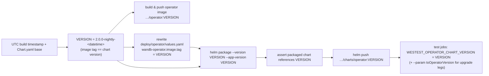
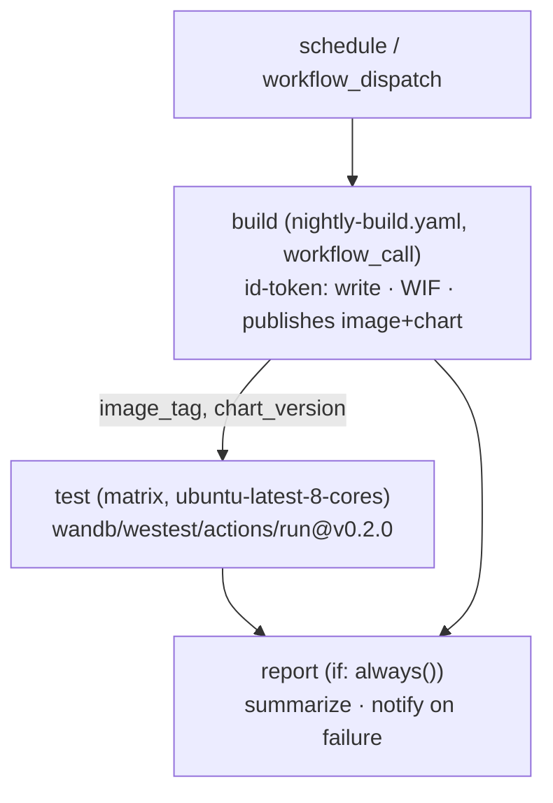

# Nightly WESTest testing — plan & runbook

**Status:** proposed (plan for review). **Owner:** `@wandb/on-prem-team`.

This document is the plan and the operator-side documentation for adding
automated **nightly end-to-end testing** of the W&B operator using the
[`wandb/westest/actions/run`](https://github.com/wandb/westest/tree/main/actions/run)
composite GitHub Action. It covers the workflows to build, the order to build
them in (phased), the prerequisites that must be in place first, and a runbook
for operating them.

It is deliberately concrete: every load-bearing claim below was verified against
this repo and the `wandb/westest` repo, with `file:line` citations in
[References](#references).

---

## 1. Goal & non-goals

**Goal.** Every night, exercise the operator against a real Kubernetes stack
(Kind) across a growing set of WESTest scenarios and multiple W&B app versions,
so operator regressions are caught within a day instead of at release time.

**Non-goals (for now).**
- Gating PR merges or releases on WESTest (nightly is advisory first; gating is a
  later decision).
- Cloud scenarios (`aws-eks-*`, `gcp-gke-*`) in the nightly critical path — they
  need cloud credentials, a license, and real spend, so they stay on-demand.
- Changing anything in `wandb/westest` itself. Two small upstream gaps are noted
  where they constrain us (see [§8](#8-known-scenario--param-gaps)).

---

## 2. Background: how WESTest tests the operator

`wandb/westest/actions/run` provisions a Kind cluster, installs cert-manager and
the **operator Helm chart**, applies a scenario CR, waits for the stack, runs
`wandb verify`, collects artifacts, and tears down. A run takes ~30–50 min.

Two facts drive this entire plan:

1. **WESTest installs the *published* operator chart from the same OCI repo this
   repo publishes to** — its baked-in default is literally
   `oci://us-docker.pkg.dev/wandb-production/public/wandb/charts/operator`
   version `2.0.0-beta.3`, which matches our current [Chart.yaml](../deploy/operator/Chart.yaml).
   The chart version is overridable via `--param …operatorChartVersion` or the
   `WESTEST_OPERATOR_CHART_VERSION` env var
   ([config.go:27,30,309](https://github.com/wandb/westest)).

2. **WESTest does not override the operator image.** The action has no image
   input; the operator binary that runs is whatever the installed chart's baked
   `wandb-operator.image.tag` points at ([values.yaml:16-18](../deploy/operator/values.yaml)).

> **The consequence that shapes everything:** to test *nightly operator code*, we
> must first publish a **nightly chart whose `wandb-operator.image.tag` points at
> a freshly built nightly image**. Publishing a `-dev` chart that still references
> `2.0.0-beta.3` would produce green-but-meaningless nightlies that validate a
> stale operator. Hence a **nightly build** is a hard prerequisite for the tests.

The existing `internal-image-publish.yaml` / `internal-chart-publish.yaml`
workflows already do the image/chart pushes with GCP Workload Identity auth —
**but they package the chart tree verbatim and never rewrite the image tag**, and
their `dev-…` naming regexes don't fit a datetime scheme, so they can't be reused
as-is for the nightly. The nightly build reuses their *mechanics* (auth +
`make docker-*` + `helm package`/`push`) but adds its own datetime versioning, the
image-tag rewrite, and a chart↔image consistency check on top.

---

## 3. Version flow (the core mechanic)

A single derivation in the build job produces **one version string used for both
the image tag and the chart version**, and threads it into every test job:



The image-tag rewrite and the `Chart.yaml` version bump happen **only in the
workflow's ephemeral checkout** — they are never committed. This is what keeps the
nightly from tripping `release.yaml`, which rejects `-dev` tags and enforces
`chart == appVersion == image.tag == git tag` ([release.yaml:41-84](../.github/workflows/release.yaml)).

---

## 4. Architecture

Three workflow files:

| File | Trigger | Purpose |
|------|---------|---------|
| `.github/workflows/nightly-build.yaml` | `workflow_call` | Reusable: derive version, build+push nightly image, bake tag into chart, package+push nightly chart. Emits `image_tag` / `chart_version` outputs. |
| `.github/workflows/nightly.yaml` | `schedule` + `workflow_dispatch` | Orchestrator: `build` → fan-out `test` matrix on `ubuntu-latest-8-cores` → `report`. |
| `.github/workflows/nightly-cleanup.yaml` | `schedule` (weekly) | Garbage-collect old `*-nightly-*` images and charts from GAR (or use a native Artifact Registry cleanup policy — see [§10](#10-garbage-collection)). |



**Why one run with job outputs** (rather than chaining `workflow_dispatch` runs):
the nightly version is a plain string, trivially passed via
`needs.build.outputs.chart_version` with no artifact hand-off or `gh workflow
run` polling, and build + every scenario show up together in one Actions run.

**Permissions are scoped:** only `build` gets `id-token: write` (for WIF). The
`test` and `report` jobs get `contents: read`.

---

## 5. Versioning scheme

**The image tag and the chart version are the same string** — one
`VERSION = <base>-nightly-<datetime>` used for both (they live in different GAR
repos, so identical tags don't clash and are trivial to correlate). The value must
be valid SemVer 2, because a **Helm chart version must be** (an image tag could be
arbitrary, but matching them is the whole point here):

| Artifact | Tag / version | Note |
|----------|---------------|------|
| Operator image tag | `2.0.0-nightly-<datetime>` | Same string as the chart. e.g. `2.0.0-nightly-20260819-070001` (UTC `YYYYMMDD-HHMMSS`). |
| Chart `version` == `appVersion` | `2.0.0-nightly-<datetime>` | Valid SemVer: the prerelease `nightly-<datetime>` is a single alphanumeric identifier (dashes only, no dots), so the no-leading-zero rule for numeric identifiers doesn't apply. |

Notes:
- **Base version.** The `2.0.0` core is read from `deploy/operator/Chart.yaml` at
  build time (strip any prerelease suffix). While the release line is still
  pre-2.0.0 (`2.0.0-beta.*`), a `2.0.0-nightly-<datetime>` sorts correctly —
  *above* the latest beta (`beta` < `nightly`) and *below* the eventual `2.0.0`
  release.
- **Future — lead with the next semver.** Once `2.0.0` is **officially released**
  (Chart.yaml carries a GA version with no prerelease), `2.0.0-nightly-*` would
  sort *below* the released `2.0.0` and read as stale. At that point the build
  should lead with the **next** version — e.g. bump the patch/minor to
  `2.0.1-nightly-<datetime>` (or `2.1.0-…`) so nightlies always sort above the last
  release. This is a one-line change to the base derivation (see the `TODO` in the
  build workflow); deferred until 2.0.0 ships.
- **Uniqueness.** The datetime is unique per run, so there's no version collision
  and no need for a skip-if-exists / reject guard — a manual re-run just produces a
  new nightly. (We deliberately don't reuse `internal-chart-publish.yaml`'s `-dev.`
  regex or its hard `exit 1` reject step.)
- **Commit traceability.** Because the tag is time-based, not sha-based, the build
  records the commit sha in the job summary and the failure notification (and the
  Actions run is already tied to the commit), so a red nightly stays bisectable.

---

## 6. Phased rollout

Each phase is independently shippable and gated by the previous one. Cost and the
number of moving parts grow only after the cheap, high-uncertainty risks are
retired.

### Phase 0 — throwaway bootstrap (prove the path)
- **Do:** manually `workflow_dispatch` the build to publish one nightly artifact,
  then run **one** scenario (`local-kind-ingress`) against it by hand.
- **Proves, at minimum cost:** the cross-repo WESTest download works, the
  `ubuntu-latest-8-cores` runner schedules the full stack, and the nightly chart
  actually runs the nightly binary.
- **Exit:** one green `local-kind-ingress` run whose operator image is
  `2.0.0-nightly-<datetime>`.

### Phase 1 — self-contained smoke (nightly)
- **Scenarios:** `local-kind-ingress`, `local-kind-gateway`, `local-kind-oidc`,
  `local-kind-proxy` — all `status: implemented`, no license, no cloud.
- **Operator:** nightly chart via job-level `WESTEST_OPERATOR_CHART_VERSION`
  (these scenarios have no version param). Default app version.
- **Exit:** all four `result=passed`, artifacts uploaded, on a schedule.

### Phase 2 — operator transition legs (nightly)
- **Scenarios & params:**
  - `local-kind-operator-upgrade` — `fromOperatorVersion=2.0.0-beta.3`,
    `toOperatorVersion=<nightly>`.
    **You must override the from-leg.** Its `install-old` phase defaults to
    `2.0.0-westest-validation.0`, and in SemVer `2.0.0-nightly-* < 2.0.0-westest-validation.0`
    (`n` < `w`), so setting only `toOperatorVersion` would upgrade *downward* — a
    semantic downgrade that migration/version validators may misread. A published
    `beta` from-leg (`beta` < `nightly`) is a real upgrade.
  - `local-kind-operator-v1-to-v2` — `toOperatorVersion=<nightly>` (installs the
    published v1 chart `1.4.7`, then upgrades to the nightly v2 chart).
- **Exit:** both green, including `cr-conversion-check` / `migration-check`.

### Phase 3 — app-version sweep (nightly)
- **Scenario:** `local-kind-app-upgrade` (it has a `params:` block).
  `local-kind-app-roundtrip` is intentionally excluded — it has **no `params:`**,
  so its `0.82.2 → 0.83.0` legs are hardcoded and cannot sweep (upstream gap).
- **Matrix (example):**

  | fromAppVersion | toAppVersion | leg |
  |---|---|---|
  | 0.82.2 | 0.83.0 | baseline |
  | 0.83.0 | 0.84.0 | N-1 → N |
  | 0.82.2 | 0.84.0 | skip-a-version |

- **Artifacts:** the action names uploads `westest-<scenario>`, so app-version
  variants of one scenario collide. Set `upload-artifacts: false` and re-upload
  with a version-suffixed name, or accept one artifact per scenario.
- **Exit:** matrix green.

### Phase 4 — heavy / cloud (weekly + on-demand, not nightly)
- **Weekly:** `local-kind-app-roundtrip` (3-phase DB durability — pins operator
  `2.0.0-beta.1`, so it's a *product* guard, not a nightly-operator test),
  `local-kind-proxy-tls` / `-proxy-auth` / `-proxy-misconfig`,
  `local-kind-airgap` (registry mirroring — the flakiest self-contained path).
- **On-demand `workflow_dispatch`:** `aws-eks-*`, `gcp-gke-*`, `local-crc-ingress`
  — need cloud creds + a license secret + real spend.

**Nightly vs weekly vs on-demand rationale:** keep the nightly cloud-free,
license-free, and deterministic so **a red nightly always means a real operator
regression, not infra noise**. Long, flaky, or billed scenarios move off the
critical path.

---

## 7. Prerequisites checklist (must be done before Phase 1)

- [ ] **Cross-repo read access to `wandb/westest`.** The action runs
      `gh release download --repo wandb/westest` with the **caller's**
      `github.token` (hardcoded — [action.yml:140-161](https://github.com/wandb/westest)),
      and `wandb/westest` is private. The operator repo's `GITHUB_TOKEN` cannot
      read it by default → **every test job 404s on step one**. Fix: in
      `wandb/westest` → *Settings → Actions → General → Access* grant
      "Accessible from repositories owned by the organization" (or make westest
      `internal`). A PAT/App token can't be injected through the action (the token
      is hardcoded); the only PAT route is pre-downloading the binary and passing
      the action's `binary:` input.
- [ ] **`ubuntu-latest-8-cores` confirmed available** to this repo. The full
      local-kind stack (ClickHouse+Keeper, MySQL, Kafka, etcd, SeaweedFS, Redis +
      operators) needs ≥8 vCPU; standard ~2-vCPU runners leave MySQL and the
      ClickHouse keeper `Pending` on `Insufficient cpu`.
- [ ] **WIF secrets present** (reused from `release.yaml`):
      `CI_WORKLOAD_IDENTITY_PROVIDER`, `CI_WORKLOAD_IDENTITY_SERVICE_ACCOUNT`.
- [ ] **Pin `westest-version`** to an explicit release tag (`v0.2.0` today) — the
      action's default `latest` resolves by creation date and makes nightlies
      non-reproducible.
- [ ] **Pin the action + its sub-actions by SHA** for supply-chain safety once the
      westest release cadence is known (start on `@v0.2.0`).
- [ ] **Failure alerting** wired in the `report` job — no e2e paging exists today
      (`run-tests.yaml` is unit/envtest only), so reds would rot silently.
- [ ] **GAR cleanup** decided (native cleanup policy preferred) — see [§10](#10-garbage-collection).

---

## 8. Known scenario / param gaps

Verified upstream, and they bound what we can do today:

- `local-kind-app-roundtrip` has **no `params:` block** → app versions are
  hardcoded and not CLI-overridable (Phase 4 weekly, not swept).
- `local-kind-operator-upgrade`'s from-leg is temporarily pinned to
  `2.0.0-westest-validation.0` (scenario TODO to move to an official release once
  a second official beta exists). We override it with `fromOperatorVersion` — do
  **not** try to compute "latest published beta" dynamically from GAR tags
  (lexicographic ordering makes `beta.9 > beta.10`); pin a known-good from-leg and
  bump it deliberately.
- `WESTEST_OPERATOR_CHART_VERSION` / `config.go` default to `2.0.0-beta.3`, so any
  version leg you don't explicitly set silently tests beta.3. **Set every version
  leg explicitly.**

---

## 9. Risks & mitigations

| # | Risk | Mitigation (baked into the plan) |
|---|------|----------------------------------|
| 1 | Nightly chart runs the **old** operator (chart never rewrites image tag) | Build rewrites `values.yaml` image tag **and** bumps chart version/appVersion; `helm template` asserts the packaged chart references the nightly image **before** any test runs. |
| 2 | Cross-repo private download fails with `github.token` | Grant org-access on `wandb/westest` (prereq); prove with Phase 0 before enabling the matrix. |
| 3 | Version collision on re-run | The `<datetime>` tag is unique per run, so re-runs never collide; no skip-if-exists needed. |
| 4 | Unpinned WESTest `latest` → non-reproducible nightlies | Pin `westest-version:` to an explicit tag. |
| 5 | Infra flake (8 helm repos, image pulls, Kind readiness, host-port 80/443 collisions, GAR read-after-write) | One scenario per runner; `fail-fast: false`; `timeout-minutes`; optional retry-once. `test` runs only after `build` fully completes (`needs: build`), so the nightly chart is already published before any pull. |
| 6 | Cost of `ubuntu-latest-8-cores` × matrix × nightly | Tier nightly (smoke) vs weekly (heavy); cap `max-parallel`; per-job `timeout-minutes`. |
| 7 | Version-leg semantics (downgrade past `westest-validation.0`; beta lexicographic ordering) | Override **both** legs of `operator-upgrade` explicitly; pin from-legs to official releases. |
| 8 | Reds rot silently; supply-chain drift | `report` job notifies; pin action + sub-actions by SHA; scope `id-token: write` to the build job only. |

---

## 10. Garbage collection

A unique image + chart every night means **unbounded GAR growth**. Two options:

- **Preferred — Artifact Registry cleanup policy** on the `operator` and
  `charts` repos: delete versions whose tag matches `*-nightly-*` and are older
  than N days (e.g. 14). Declarative, no workflow to maintain.
- **Fallback — `nightly-cleanup.yaml`** (weekly): `gcloud artifacts docker images
  list … --filter` + `delete`, excluding a keep-list. Filters must be validated
  carefully so it never touches release tags (`2.x.y`, `v2.*`).

Either way, keep a **`nightly-last-green`** pointer (a floating tag or a value in a
tracking issue) advanced only on an all-green nightly, so humans always have a
known-good reference. Nightlies are otherwise disposable — "rollback" is just not
advancing that pointer; nothing needs to be un-published.

---

## 11. On-demand PR testing (related, not nightly)

For testing an operator **branch** before it's published, WESTest builds from a
local checkout — no GAR write needed:

```yaml
# .github/workflows/westest-pr.yaml  (workflow_dispatch, on-demand)
- uses: actions/checkout@34e114876b0b11c390a56381ad16ebd13914f8d5 # v4
- uses: wandb/westest/actions/run@v0.2.0
  with:
    scenario: local-kind-operator-v1-to-v2
    operator-repo: ${{ github.workspace }}   # flips the operator source to local build
    westest-version: v0.2.0
```

This is the same action, a different entrypoint: PR path = source build (no
publish); nightly path = publish + remote chart.

---

## 12. Reference implementation

Ready-to-adapt YAML. Action pins and the WIF auth block mirror the existing
workflows. **Do not enable the `schedule` trigger until the [prerequisites](#7-prerequisites-checklist-must-be-done-before-phase-1) are met** —
start with `workflow_dispatch` only (Phase 0).

### `.github/workflows/nightly-build.yaml` (reusable)

```yaml
name: Nightly Build (reusable)

on:
  workflow_call:
    inputs:
      ref:
        type: string
        required: false
        default: ""
    outputs:
      image_tag:
        value: ${{ jobs.build.outputs.image_tag }}
      chart_version:
        value: ${{ jobs.build.outputs.chart_version }}

env:
  IMAGE_REPOSITORY: us-docker.pkg.dev/wandb-production/public/wandb/operator
  CHART_REPOSITORY: us-docker.pkg.dev/wandb-production/public/wandb/charts

jobs:
  build:
    name: Build & publish nightly image + chart
    runs-on: ubuntu-latest
    permissions:
      contents: read
      id-token: write
    outputs:
      image_tag: ${{ steps.version.outputs.image_tag }}
      chart_version: ${{ steps.version.outputs.chart_version }}
    steps:
      - name: Checkout
        uses: actions/checkout@34e114876b0b11c390a56381ad16ebd13914f8d5 # v4
        with:
          fetch-depth: 0
          persist-credentials: false
          ref: ${{ inputs.ref }}

      - name: Derive nightly version
        id: version
        shell: bash
        run: |
          set -euo pipefail
          ts="$(date -u +%Y%m%d-%H%M%S)"
          sha="$(git rev-parse --short=7 HEAD)"
          # Lead with the current chart's release line (strip any prerelease suffix).
          # TODO: once 2.0.0 is GA (Chart.yaml has no prerelease), lead with the NEXT
          # semver (bump patch/minor) so nightlies sort ABOVE the last release rather
          # than below it as a 2.0.0 prerelease.
          base="$(awk '$1 == "version:" { print $2; exit }' deploy/operator/Chart.yaml | tr -d '"' | cut -d- -f1)"
          # One version string for BOTH the image tag and the chart version.
          version="${base}-nightly-${ts}"
          echo "image_tag=${version}" >> "${GITHUB_OUTPUT}"
          echo "chart_version=${version}" >> "${GITHUB_OUTPUT}"
          {
            echo "### Nightly build"
            echo "- version (image + chart): \`${version}\`"
            echo "- image: \`${IMAGE_REPOSITORY}:${version}\`"
            echo "- chart: \`${CHART_REPOSITORY}/operator:${version}\`"
            echo "- commit: \`${sha}\`"
          } >> "${GITHUB_STEP_SUMMARY}"

      - name: Install Helm
        uses: azure/setup-helm@bf6a7d304bc2fdb57e0331155b7ebf2c504acf0a # v4
        with:
          version: v3.19.0

      - name: Set up Cloud SDK
        uses: google-github-actions/setup-gcloud@aa5489c8933f4cc7a4f7d45035b3b1440c9c10db # v3.0.1

      - id: auth
        name: Authenticate to Google Cloud
        uses: google-github-actions/auth@7c6bc770dae815cd3e89ee6cdf493a5fab2cc093 # v3
        with:
          create_credentials_file: "true"
          token_format: access_token
          project_id: wandb-production
          workload_identity_provider: ${{ secrets.CI_WORKLOAD_IDENTITY_PROVIDER }}
          service_account: ${{ secrets.CI_WORKLOAD_IDENTITY_SERVICE_ACCOUNT }}

      - name: Authorize Docker for Artifact Registry
        run: gcloud auth configure-docker us-docker.pkg.dev --quiet

      - name: Bake nightly image tag into chart values
        env:
          IMAGE_TAG: ${{ steps.version.outputs.image_tag }}
        run: |
          set -euo pipefail
          # yq v4 is preinstalled on ubuntu-latest.
          yq -i '.["wandb-operator"].image.tag = strenv(IMAGE_TAG)' deploy/operator/values.yaml

      - name: Build and push nightly image
        env:
          IMAGE_TAG: ${{ steps.version.outputs.image_tag }}
        run: make docker-build docker-push IMG="${IMAGE_REPOSITORY}:${IMAGE_TAG}"

      - name: Resolve chart dependencies
        run: |
          set -euo pipefail
          helm repo add ci-wandb https://charts.wandb.ai/
          helm repo add ci-moco https://cybozu-go.github.io/moco/
          helm repo add ci-ot-container-kit https://ot-container-kit.github.io/helm-charts
          helm repo add ci-seaweedfs https://seaweedfs.github.io/seaweedfs-operator/
          helm repo add ci-prometheus-community https://prometheus-community.github.io/helm-charts
          helm repo add ci-altinity https://helm.altinity.com
          helm repo add ci-victoria-metrics https://victoriametrics.github.io/helm-charts/
          helm repo add ci-grafana https://grafana.github.io/helm-charts
          helm dependency build deploy/operator

      - name: Package, verify, and push nightly chart
        env:
          IMAGE_TAG: ${{ steps.version.outputs.image_tag }}
          CHART_VERSION: ${{ steps.version.outputs.chart_version }}
        run: |
          set -euo pipefail
          mkdir -p dist
          helm package deploy/operator \
            --version "${CHART_VERSION}" \
            --app-version "${CHART_VERSION}" \
            --destination dist
          # Guard against the "green but stale" failure mode: the packaged chart
          # must reference the nightly operator image, not the committed default.
          if ! helm template "dist/operator-${CHART_VERSION}.tgz" \
              | grep -qF "operator:${IMAGE_TAG}"; then
            echo "Packaged chart does not reference ${IMAGE_REPOSITORY}:${IMAGE_TAG}" >&2
            exit 1
          fi
          helm push "dist/operator-${CHART_VERSION}.tgz" "oci://${CHART_REPOSITORY}"
```

### `.github/workflows/nightly.yaml` (orchestrator — Phase 1 matrix shown)

```yaml
name: Nightly WESTest

on:
  workflow_dispatch: {}
  # Enable only after the prerequisites in docs/nightly-westest-testing.md §7:
  # schedule:
  #   - cron: "0 7 * * *"   # 07:00 UTC daily

concurrency:
  group: nightly-westest
  cancel-in-progress: false

env:
  WESTEST_VERSION: v0.2.0

jobs:
  build:
    uses: ./.github/workflows/nightly-build.yaml
    permissions:
      contents: read
      id-token: write
    secrets: inherit

  test:
    name: ${{ matrix.scenario }}
    needs: build
    runs-on: ubuntu-latest-8-cores
    permissions:
      contents: read
    timeout-minutes: 90
    strategy:
      fail-fast: false
      max-parallel: 3
      matrix:
        scenario:
          - local-kind-ingress
          - local-kind-gateway
          - local-kind-oidc
          - local-kind-proxy
    env:
      # Points every remote-chart scenario at the nightly chart (config.go reads
      # WESTEST_OPERATOR_CHART_VERSION). Upgrade scenarios override per-phase via
      # --param (see the Phase 2/3 matrix below).
      WESTEST_OPERATOR_CHART_VERSION: ${{ needs.build.outputs.chart_version }}
    steps:
      - name: Run scenario
        # Requires cross-repo read access to wandb/westest (see §7).
        uses: wandb/westest/actions/run@v0.2.0
        with:
          scenario: ${{ matrix.scenario }}
          westest-version: ${{ env.WESTEST_VERSION }}
          upload-artifacts: "true"

  report:
    needs: [build, test]
    if: always()
    runs-on: ubuntu-latest
    permissions:
      contents: read
    steps:
      - name: Summarize
        run: |
          echo "build=${{ needs.build.result }} chart=${{ needs.build.outputs.chart_version }}"
          echo "test=${{ needs.test.result }}"
      - name: Notify on failure
        if: needs.build.result != 'success' || needs.test.result != 'success'
        env:
          SLACK_WEBHOOK_URL: ${{ secrets.WESTEST_SLACK_WEBHOOK }}
        run: |
          set -euo pipefail
          [ -n "${SLACK_WEBHOOK_URL:-}" ] || { echo "no webhook configured"; exit 0; }
          curl -fsSL -X POST -H 'Content-type: application/json' \
            --data "{\"text\":\"Nightly WESTest failed — chart ${{ needs.build.outputs.chart_version }} — ${{ github.server_url }}/${{ github.repository }}/actions/runs/${{ github.run_id }}\"}" \
            "${SLACK_WEBHOOK_URL}"
```

**Phase 2/3 matrix (swap into `test.strategy.matrix` when those phases land):**

```yaml
      matrix:
        include:
          # Phase 1 smoke (env-driven, no params)
          - { scenario: local-kind-ingress }
          - { scenario: local-kind-gateway }
          - { scenario: local-kind-oidc }
          - { scenario: local-kind-proxy }
          # Phase 2 — operator transitions (override BOTH legs; see §6/§8)
          - scenario: local-kind-operator-upgrade
            params: |
              fromOperatorVersion=2.0.0-beta.3
              toOperatorVersion=${{ needs.build.outputs.chart_version }}
          - scenario: local-kind-operator-v1-to-v2
            params: |
              toOperatorVersion=${{ needs.build.outputs.chart_version }}
          # Phase 3 — app-version sweep
          - scenario: local-kind-app-upgrade
            params: |
              fromAppVersion=0.82.2
              toAppVersion=0.83.0
          - scenario: local-kind-app-upgrade
            params: |
              fromAppVersion=0.83.0
              toAppVersion=0.84.0
```

…and pass it through: `with: { scenario: ${{ matrix.scenario }}, params: ${{ matrix.params }}, westest-version: ${{ env.WESTEST_VERSION }} }`.

---

## 13. Runbook

**A nightly went red — is it a regression or flake?**
1. Open the failed `test` job; download its `westest-<scenario>` artifact
   (operator/pod logs, describe output).
2. Infra flake signatures: image-pull errors, helm-repo timeouts, Kind node not
   ready, host-port bind failures, GAR read-after-write. → re-run the single job.
3. If it reproduces on re-run with the same nightly chart, treat as an **operator
   regression**: the build job's summary records the commit sha for that
   `2.0.0-nightly-<datetime>` (and the Actions run is tied to it) — bisect from there.

**Re-run after a fix.** Push the fix; the next scheduled nightly builds a fresh
`2.0.0-nightly-<datetime>` automatically. To test immediately, `workflow_dispatch`
`nightly.yaml`.

**Reproduce locally.** `westest run <scenario> --param toOperatorVersion=<chart_version>`
(or `WESTEST_OPERATOR_CHART_VERSION=<chart_version> westest run <scenario>`), with
the nightly chart version from the build job's summary.

**Bump WESTest.** Change `env.WESTEST_VERSION` and the `uses:` tag in
`nightly.yaml` together, deliberately.

**Advance `nightly-last-green`.** On an all-green nightly, point it at that run's
`chart_version` so there's always a known-good reference.

---

## 14. Open decisions (need a human)

1. **Cost cap / cadence.** Which phases run daily vs weekly, and `max-parallel`
   for the 8-core matrix. (Recommendation: Phases 1–3 nightly, Phase 4 weekly.)
2. **Cross-repo access mechanism.** Org-accessible/internal grant on
   `wandb/westest` vs a GitHub App token (the latter needs an upstream `token`
   input on the action). Affects security posture.
3. **GC.** Native Artifact Registry cleanup policy vs a `nightly-cleanup.yaml`
   workflow, and the retention window (N days).
4. **Dev artifact location.** Keep publishing nightlies to the shared
   `…/public/wandb/{operator,charts}` repos (consistent with today's
   `internal-*-publish`, but publicly visible and mixed with releases), or split
   nightlies into a dedicated dev/nightly repo path (cleaner GC, smaller blast
   radius).
5. **Triage ownership.** Who owns red-nightly triage (rotation?), and where alerts
   route (Slack channel / tracking issue / PagerDuty).

---

## References

Operator repo:
- [.github/workflows/release.yaml](../.github/workflows/release.yaml) — tag-driven release; four-way version equality; rejects `-dev`.
- [.github/workflows/internal-image-publish.yaml](../.github/workflows/internal-image-publish.yaml) — `dev-<name>-<sha>` image tag regex; `make docker-build docker-push`.
- [.github/workflows/internal-chart-publish.yaml](../.github/workflows/internal-chart-publish.yaml) — `2.x.y-dev.<id>` chart regex; reject-existing guard.
- [.github/workflows/run-tests.yaml](../.github/workflows/run-tests.yaml) — unit/envtest only (no e2e today).
- [.github/workflows/chart-validation.yaml](../.github/workflows/chart-validation.yaml) — the helm-repo add block reused above.
- [deploy/operator/Chart.yaml](../deploy/operator/Chart.yaml), [deploy/operator/values.yaml](../deploy/operator/values.yaml) — chart version / `wandb-operator.image.tag`.
- [Makefile](../Makefile) — `docker-build` / `docker-push`.

`wandb/westest` (verified against the repo):
- `actions/run/action.yml` — inputs/outputs; hardcoded `GH_TOKEN: github.token`; `ubuntu-latest-8-cores` requirement; `westest-version: latest` default.
- `docs/ci-integration-decision.md` — the accepted integration direction (self-contained binary + composite action; runner sizing; out-of-scope items).
- `tools/runner/internal/westest/config.go:27,30,309` — default operator chart OCI ref / version; `WESTEST_OPERATOR_CHART_VERSION`.
- `scenarios/local-kind-{ingress,gateway,oidc,proxy,operator-upgrade,operator-v1-to-v2,app-upgrade,app-roundtrip}.yaml` — scenario params & pins.
